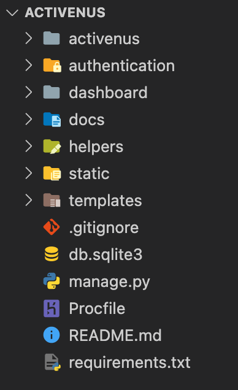
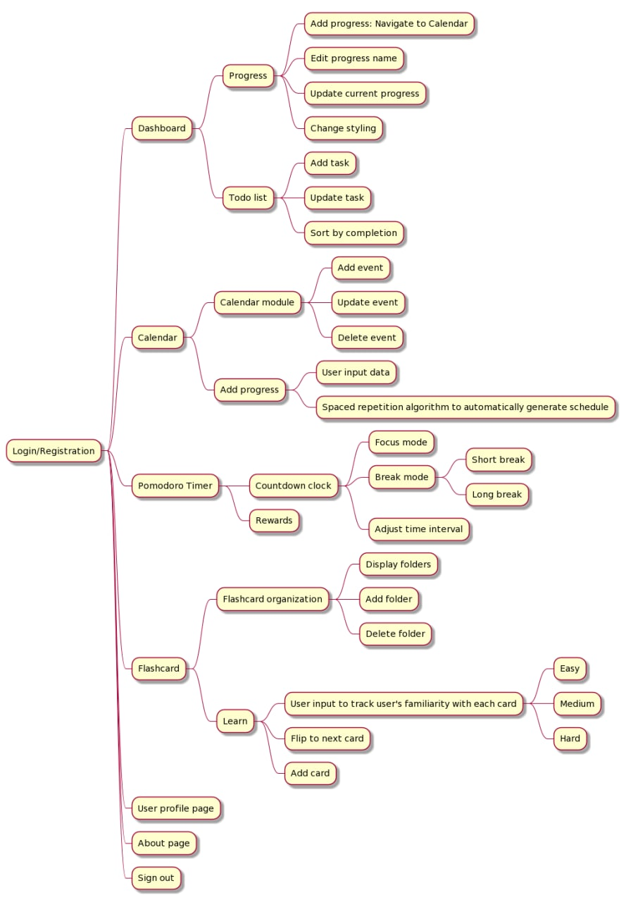
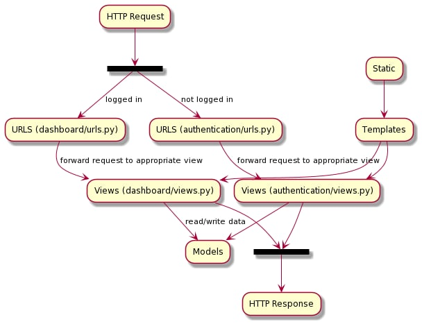
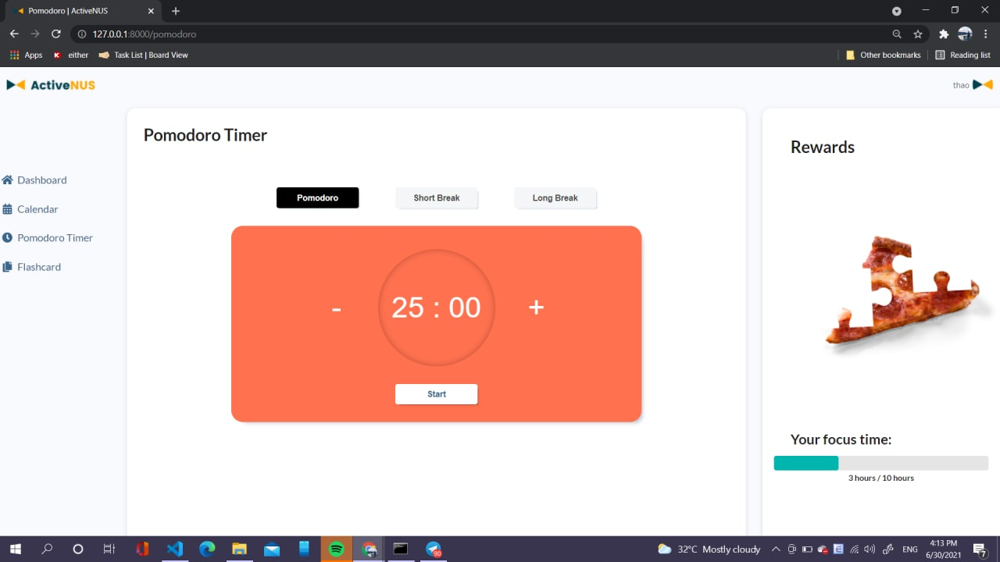
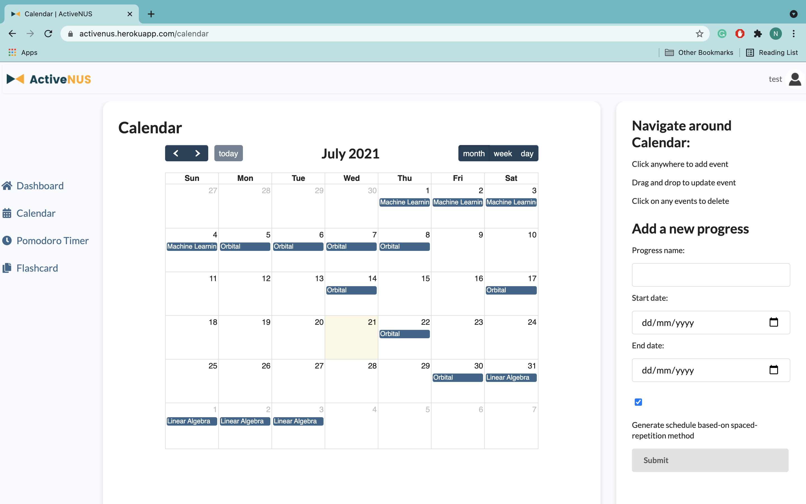
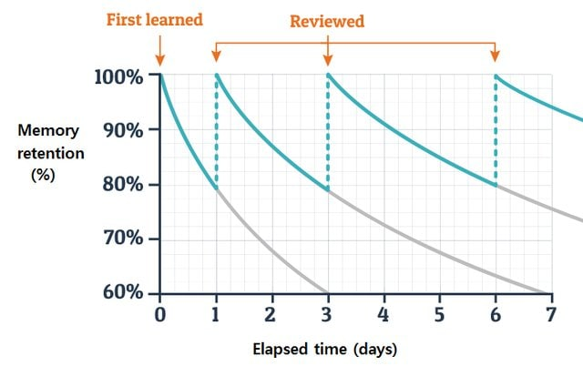
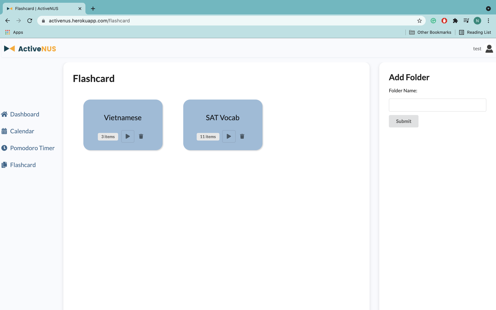
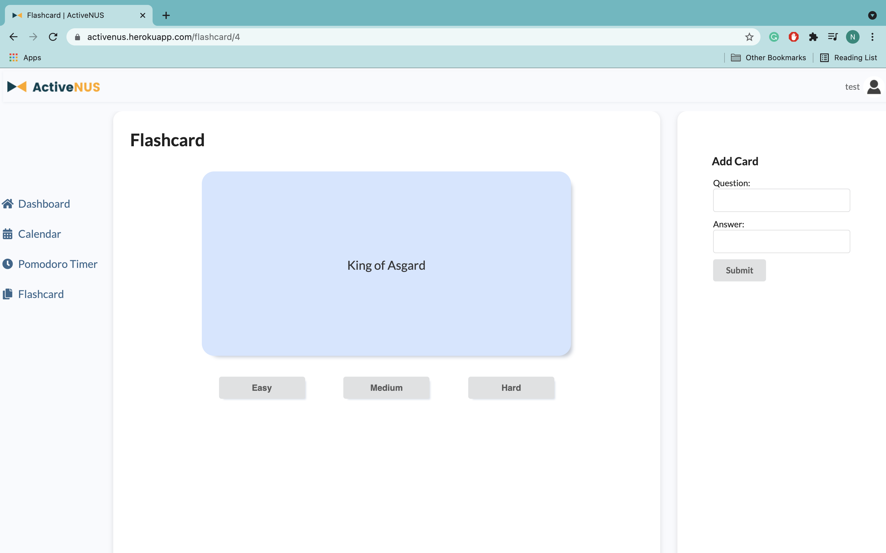
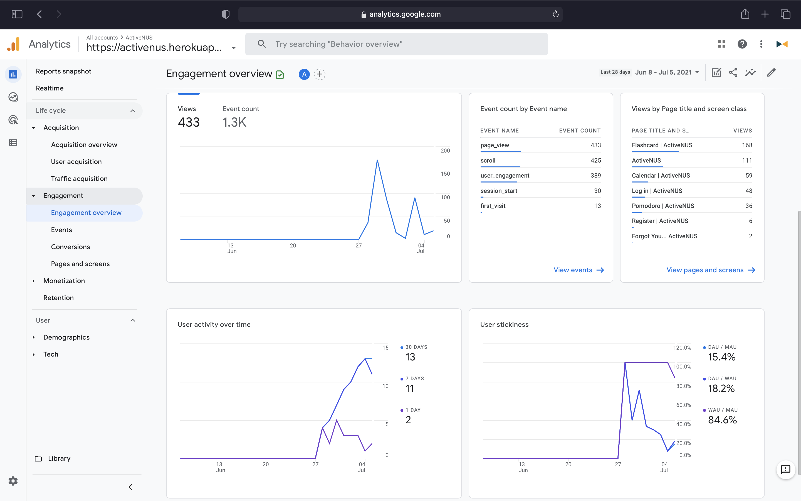

# Documentation
---

# Table of Contents

1. [Deployment](#1-deployment)
2. [Testing Account](#2-testing-account)
3. [Videos](#3-videos)\
  3.1 [Introduction Video](#31-introduction-video)\
  3.2 [Demo Video](#32-demo-video)
4. [Proposed Level of Achievement](#4-proposed-level-of-achievement)
5. [Motivation](#5-motivation)
6. [Value Proposition](#6-value-proposition)
7. [How are we different from state-of-the-art platforms?](#7-how-are-we-different-from-state-of-the-art-platforms)\
  7.1 [Google Calendar](#71-google-calendar)\
  7.2 [Quizlet](#72-quizlet)\
  7.3 [Pomofocus](#73-pomofocus)
8. [Tech Stack](#8-tech-stack)
9. [Set Up Instruction](#9-set-up-instruction)
10. [Target User Profile](#10-target-user-profile)
11. [User Stories](#11-user-stories)
12. [Overall Design](#12-overall-design)\
  12.1 [Core Features](#121-core-features)\
  12.2 [User Interface Design](#122-user-interface-design)\
  12.3 [Program Flow](#123-program-flow)\
  &nbsp;&nbsp;&nbsp;&nbsp;12.3.1 [Activity Diagram](#1231-activity-diagram)\
  &nbsp;&nbsp;&nbsp;&nbsp;12.3.2 [Web Mechanism Diagram](#1232-web-mechanism-diagram)
13. [Project Scopes](#13-project-scopes)\
  13.1 [Milestone 1: Setting up authentication and administration](#131-milestone-1-setting-up-authentication-and-administration)\
  13.2 [Milestone 2: Building the core](#132-milestone-2-building-the-core)\
  13.3 [Milestone 3: Extension](#133-milestone-3-extension)
14. [Testing](#14-testing)\
  14.1 [Automated Testing](#141-automated-testing)\
  &nbsp;&nbsp;&nbsp;&nbsp;14.1.1 [View Testing](#1411-view-testing)\
  &nbsp;&nbsp;&nbsp;&nbsp;14.1.2 [Model Testing](#1412-model-testing)\
  &nbsp;&nbsp;&nbsp;&nbsp;14.1.3 [Running Tests](#1413-running-tests)\
  14.4 [Manual Testing](#142-manual-testing)

  Response to Milestone Evaluations 

15. [Software Security Measures](#16-software-security-measures)\
  16.1 [CSRF Token](#161-csrf-token)\
  16.2 [Password Hashing](#162-password-hashing)
17. [Software Design Patterns and Principles](#17-software-design-patterns-and-principles)\
  17.1 [Single Level of Abstraction Principle (SLAP)](#171-single-level-of-abstraction-principle-slap)\
  17.2 [Don’t Repeat Yourself (DRY) Principle](#172-dont-repeat-yourself-dry-principle)
18. [Software Engineering Practices](#18-software-engineering-practices)\
  18.1 [Virtual Environment](#181-virtual-environment)\
  18.2 [Version Control](#182-version-control)\
  18.3 [Continuous Integration / Continuous Delivery (CI/CD)](#183-continuous-integration--continuous-delivery-cicd)

&nbsp;  


# 1. Deployment

[activenus.herokuapp.com](https://activenus.herokuapp.com/){:target="_blank"}

# 2. Testing Account

Username: test

Password: testingexamplepassword

# 3. Videos

## 3.1 Introduction Video
[](https://youtu.be/ZSS92-gmpTY){:target="_blank"}

## 3.2 Demo Video
[](https://youtu.be/QgBkij0k48A){:target="_blank"}


# 4. Proposed Level of Achievement
Apollo 11

# 5. Motivation
A lot of students, especially university/college students, have frequent problems with study planning. They end up panicking, don’t know where to begin, and finally do not prepare well, which is the main reason for bad performances in tests and examinations.

Some are able to plan their study using available timetable-making applications in the market. However, few of these tools actually know what users need, and most of them are not optimal for learning management. Why isn’t there a tool that can help you keep track of your learning process and plan your study in a productive way?

# 6. Value Proposition
We hope to make a website that helps users, especially students, plan for work and study in general and promotes efficient study methods, namely active recall and spaced repetition.

The science behind active recall and spaced repetition:
* Active recall is the process of actively drawing information from your memory. It is a proven efficient way of moving knowledge from short-term to long-term memory compared to traditional passive revision, namely rereading, highlighting, etc. 
* Spaced repetition entails spacing the revision of the topics at specific intervals over time, which is proven to be beneficial by the 'forgetting curve.' We can take advantage of the forgetting curve by breaking the cycle by reviewing material at spaced intervals. The more we practice and the more spaced this repetition becomes, we will likely encode this information into our long-term memory.

How is active recall and spaced repetition incorporated into ActiveNUS:
* Calendar: our calendar has a built-in schedule recommendation feature based on the logic of spaced repetition and forgetting curve, helping students plan their studies more efficiently. 
* Flashcards:
  * Active recall is highly encouraged by flashcards. Flashcard is an effective and fun strategy for students to test themselves and utilize their cognitive power more actively
  * Spaced repetition: our flashcard module employs an algorithm that automatically renders a sequence of flashcards based on users’ feedback. The time interval between studying each flashcard will be optimized by the spaced repetition method.

# 7. How are we different from state-of-the-art platforms?

## 7.1 Google Calendar: 
The Calendar application of ActiveNUS has a recommendation system based on active recall and spaced repetition. The users will be provided the most effective study schedule.

## 7.2 Quizlet: 
Our flashcard system employs an underlying algorithm to sort items according to users’ familiarity with their contents.

## 7.3 Pomofocus: 
Our Pomodoro module is not a stand-alone count-down timer, but a useful part of a highly interconnected system. Each successful focus cycle is recorded and updated automatically to the Calendar module.

# 8. Tech Stack

### Frontend
* HTML/CSS/JavaScript
* VueJS

> We choose to use a front-end framework along with HTML/CSS/JavaScript to have more flexibility in creating single-page applications. We considered ReactJS and VueJS and ended up using the latter since it is easier to integrate VueJS with the other component of ActiveNUS.

### Backend & Database
* Python
* Django
* PostgreSQL

> Since both developers are experienced with Python, we choose Django, which is a "high-level Python Web framework that encourages rapid development and clean, pragmatic design", for ActiveNUS. Django provides bundles of components and applications that allow us to build applications with full functionalitites and extensibility.
> 
> We also choose PostgreSQL to store and manage data for the final product instead of SQLite3 (Django default databse) since PostgreSQL is more compatible with Heroku (to be mentioned) and can manage a larger amount of data.

### Server Deployment
* Heroku

> Heroku is one of the longest running and popular cloud-based web hosting services. We choose Heroku for ActiveNUS because of the following reasons:
> 
> - It is a Platform as a Service, which takes care a lot of the web infrastructure.
> - Its free tier gives us enough resources for ActiveNUS.
> - Easy to maintain and scale applications on Heroku.

# 9. Set Up Instruction

Change into the directory you want to store the code (the directory must not contain any non-empty directory named `ActiveNUS`).

Clone the codebase by `$ git clone https://github.com/nvbinh15/ActiveNUS.git`

A new `ActiveNUS` directory will be created in the current directory.

Change into the `ActiveNUS` directory.

Directory structure:



Create a virtual environment with `python3` by running `$ virtualenv -p python3 venv`. A new directory called `venv` will be created in the current directory.

Activate the `venv` environment by running `$ source venv/bin/activate`. You are now switching to the `venv` environment.

Install all the required packages by running `$ pip install -r requirements.txt`

The following packages will be installed into the current environment (`venv`):

|Package|Version|
|-------|-------|
|`appdirs`|1.4.4|
|`arrow`|0.14.7|
|`asgiref`|3.3.4|
|`certifi`|2020.12.5|
|`chardet`|4.0.0|
|`coverage`|5.5|
|`distlib`|0.3.1|
|`dj-database-url`|0.5.0|
|`Django`|3.2.3|
|`django-heroku`|0.0.0|
|`django-ical`|1.8.0|
|`django-recurrence`|1.10.3|
|`firelock`|3.0.12|
|`gunicorn`|20.1.0|
|`heroku`|0.1.4|
|`icalendar`|4.0.7|
|`ics`|0.7|
|`idna`|2.10|
|`pipenv`|2021.5.29|
|`python-detautil`|1.5|
|`pytz`|2021.1|
|`requests`|2.25.1|
|`six`|1.16.0|
|`sqlparse`|0.4.1|
|`TatSu`|4.4.0|
|`urllib3`|1.26.5|
|`validate-email`|1.3|
|`virtualenv`|20.4.7|
|`virtualenv-clone`|0.5.4|
|`whitenoise`|5.2.0|
|`psycopg2-binary`|2.8.6|
|`supermemo2`|2.0.0|

Create a new file `.env` in the current directory that stores all the environment information. Type in your secret key (django secret key), your email address, and your email password. The content of the file should be like this:

```
export SECRET_KEY=’<YOUR_SECRET_KEY>’
export EMAIL_FROM_USER=<YOUR_EMAIL_ADDRESS>
export EMAIL_HOST_PASSWORD=<YOUR_EMAIL_PASSWORD>
```

Activate the `.env` file by running `$ source .env`

Now, everything is set up. You can run the website locally by `$ python manage.py runserver`. The local server deployment should be found at [http://127.0.0.1:8000/](http://127.0.0.1:8000/).

```
Watching for file changes with StatReloader
Performing system checks...

System check identified no issues (0 silenced).
July 01, 2021 - 15:07:06
Django version 3.2.3, using settings 'activenus.settings'
Starting development server at http://127.0.0.1:8000/
Quit the server with CONTROL-C.
```


# 10. Target User Profile
* Users who prefer managing their schedule digitally
* Students approaching exam period
* Students who want to incorporate active recall and spaced repetition methods into their studying routines
* Students who want to use effective revision methods
* Users who want to have a platform to share and learn from the others

# 11. User Stories

| As a ... | I want to ... | So that I can ... |
|----------|---------------|-------------------|
|user|have a highly interconnected work/study management tool|easily navigate around the workspace and not be bothered by mundane administrative tasks|
|student|get recommendations on effective revision schedule|ncorporate active recall and spaced repetition methods into their studying routines|
|user|organize my tasks, keep track of work/study progress|manage my time effectively|
|user|use Pomodoro timer while working and studying|avoid distractions and work/study with the optimal productivity|
|student|create flashcards based on the topic I have studied and use them later on|revise effectively|
|user (especially student)|use my time effectively with a Pomodoro timer and get rewards|avoid being distracted while working and studying|
|users|write posts in the forum, see the others’ posts, chat with my friends within the ActiveNUS community|share my schedule, learning tips, and learn from the others|
|administrator|identify abusers, warn them and ban them if they continue to cause problems|prevent abuse of the system|

# 12. Overall Design

We aim to make a website that helps users, especially students, plan for work and study in general and promotes efficient study methods, namely active recall and spaced repetition. To achieve this goal, we came up with the overall design for ActiveNUS.

## 12.1 Core Features

**Dashboard:** a comprehensive overview of your work/study progress and daily tasks 

**Calendar:** help you plan and track your studies with built-in active recall and spaced repetition logic.
* Export iCalendar file so that users can sync with other platforms (e.g. Google Calendar)
* User-friendly GUI to add a study session and categorize it based on modules or topics
* Tracking is enhanced by options to evaluate the studying session (how familiar the user is with the topic after revising).

**Pomodoro timer:**
* A timer that runs for a default period of 25 minutes focus time and 5 minutes break (user has the option to make adjustment). 
* Each successful studying cycle will be recorded into the tracking calendar. Most of the administrative work is automatically done for the users.
* Send a notification at the system level (when the user is navigating outside the website)
* Users will be rewarded for each successful attempt.

**Flashcards systems:** Flashcard is an indispensable component of the active recall studying method
* Create folders of flashcards based on the topic you are studying for. 
* Accessing the flashcards folder for the topic or module directly from the dashboard

## 12.2 User Interface Design
ActiveNUS’s main target users are students and young people. Therefore, we choose a modern design language for the platform. Furthermore, we also promote simplicity in design, helping users get the best experience of learning and working with ActiveNUS.

The UI style guide and prototypes are included below.


&nbsp;


## 12.3 Program Flow

### 12.3.1 Activity Diagram




#### Login/Registration

Users can easily register for an account using email address and log in to ActiveNUS.

#### Dashboard

Once logged in, users are greeted with a comprehensive overview of their long-term progress and daily to-do list. 

As for progress, they can add, edit and change the styling of their progress box according to their likings. Progress adding is directly linked to the active recall automatic scheduler discussed in the calendar module. 

For daily tasks, users can add, cross out, delete and sort their tasks. They can also add labels and priority for their daily tasks.

#### Calendar

Users of ActiveNUS will also benefit from a scheduling tool with our built-in calendar module. Users are able to add, delete and update events. Users can also easily navigate to different dates, or view your monthly, weekly and daily calendar. 

For better user experience, ActiveNUS allows users to integrate with external calendars, they can add events to their Google calendar and export iCal files.

#### Pomodoro Timer

Another feature which is very helpful for personal productivity is the Pomodoro timer. Pomodoro timer is a time management technique that helps users focus and balance work-relaxation. 

There are 3 modes: Pomodoro (focus mode), Short Break and Long Break. Each mode is associated with a default time interval, but users can easily change it according to their needs. 

To motivate users, ActiveNUS makes use of a reward scheme, which is a new jigsaw puzzle every week. Users have to finish more focus cycles to unlock new pieces.

#### Flashcard

Learning new concepts is also a major part of being a student. Using active recall, the flashcard method has been one of the most efficient when it comes to learning new concepts. ActiveNUS also includes an extensive flashcard module to aid students. Users can organize flashcards into folders, add flashcards and edit folders according to the topic they are learning. 

To distinguish ourselves from tons and tons of other flashcard applications, we incorporate spaced repetition into our algorithm. ActiveNUS will ask for the familiarity of users with each and every card they encounter (easy, medium or hard), then calculate immediately what is the next card they should learn. This will optimize their learning process.


### 12.3.2 Web Mechanism Diagram



ActiveNUS has the same mechanism as a typical Django web application.

**HTTP request and URLS:** ActiveNUS waits for HTTP requests from the client (web browser). It then checks whether the user is logged in or not. If not, the request will be forwarded to the appropiate view of the dashboard app (`dashboard/urls.py`). Otherwise, the task will be handled by authentication application (`authentiaction/urls.py`). The URL mapper redirects HTTP requests based on the request URL and matches particular patterns of parameters in a URL and pass these to a view function as data.

**Views:** A view (under `*/views.py`) is a request handler functions. After receiving HTTP requests, it returns HTTP responses. It also makes use of static files and templates, reads and writes data to models.

**Templates and Static:** A template is a text file defining the structure or layout of a file. Here, we use HTML pages for our application. In order to have full functional client-side web pages, we also use static files, which are CSS, JavaScript files, and images. 

**Models:** A model is a Python class that define structure of the application's data. It also provides certain methods to manage (add, delete, modify) and query records in the database.


# 13. Project Scopes
The project is broken down into 3 parts corresponding to 3 milestones.

## 13.1 Milestone 1: Setting up authentication and administration

13.1.1 Set up application components (Authentication, Dashboard, Admin)

13.1.2 Frontend Web Routing: Set up URLs for the components of the applications 

```python
from django.contrib import admin
from django.urls import path, include
from django.conf.urls.static import static
from django.conf import settings

urlpatterns = [
    path('admin/', admin.site.urls),
    path('auth/', include('authentication.urls')),
    path('', include('dashboard.urls')),
    path('accounts/', include('django.contrib.auth.urls')),
]
```

13.1.3 Set up Database using SQLite3. Models and data are stored in db.sqlite3 file.

13.1.4 Set up administration: using Django default admin app and creating a superuser.


13.1.5 Token Authentication: implement user registration and login. Users will be able to register (email verification required), and upon logging in, are authenticated and assigned a token, their password will be hashed (instead of being stored as plain text directly).


## 13.2 Milestone 2: Building the core

### 13.2.1 Dashboard

#### Description

When a user is successfully logged in, he/she is taken to a dashboard page, which displays a comprehensive overview of the user's long-term progress and daily to-do list. Users are able to manually add/delete tasks and sort tasks according to their states. 


#### Consideration

To-do list design consideration: On using to-do list, users might want to keep track of finished items but not delete them immediately. Therefore, we separate the remove button, which is minimally stylized as a trashcan and the finish toggle button.

Additionally, users can also have an option to move finished tasks to the end. This will be very helpful because in real-life usage, the order users add tasks and finish them are not the same. Hence, users can easily see at a glance which are the undone and done tasks separately. 

### 13.2.2 Pomodoro timer

#### Description

Users can navigate to the Pomodoro timer module with the navigation bar on the left. Pomodoro timer can now be used as a stand-alone feature. Users can simply press start and the timer will run for a default amount of 25 minutes. After 25 minutes of working, the user will move on to break mode. 

The focused time is recorded into local storage for future development. 

If the user wants more focus or break time, he/she can easily adjust with plus/minus buttons next to the countdown clock. The maximum time is set at 90 minutes and the minimum is 5 minutes.

After each cycle, the user receives a notification via the browser.


#### Consideration

At first our Pomodoro timer is designed with 4 buttons according to 4 different modes. The time designated for each mode is fixed at 25 minutes, 5 minutes and 15 minutes. This may cause irritation for users who want to change the focus and break time according to their needs.

Also, the 4 buttons structure in our first prototype are not intuitive for new users. Specifically, on their first encounter, without instruction, users may take a while to figure out which button corresponds to which mode and how to start a focus cycle.

Hence, in our second prototype, we replace the 4 buttons structures with a simple and intuitive start/stop toggle button and 3 buttons corresponding to 3 different modes to choose from. Furthermore, to increase more control for users, we include the plus and minus buttons for users to customize their cycle.


### 13.2.3 Calendar

#### Description

Apart from viewing daily tasks and long-term progress, users can view their schedule more comprehensively in terms of date by navigating to their calendar.

Users now can add, drag and drop to update and delete events. Users can have different view modes to cater for their needs: monthly, weekly and daily view.


#### Consideration

On view the calendar, users might want to view their schedule for the whole month or their daily detailed events. We take this into account during designing the calendar module so that users can easily navigate between different view modes (month, week and day) by using a button cluster on the top right.

Users can navigate easily between previous/next month, week or day using the 2 arrows on the top left. Also, users might want to immediately return to today’s date, hence, we add a ‘today’ button next to the arrow buttons.

### 13.2.4 Flashcard

#### Description

Users can choose to revise newly learned concepts with flashcards. Currently, there is a default deck of Greek gods. Users can add their own cards by using the form beneath.

New cards and the number of times users have visited each card are currently saved to the local storage of users’ browsers.


#### Consideration

To replicate a real flashcard, we use flipping animation that occurs when users click on anywhere on the card.

Previously, we did not allow users to add cards to the card set while in learning mode. However, doing so may affect the user's workflow. Therefore, we came up with the current implementation.

### 13.2.5 Route protection

Unauthorized users can only access the Authentication and Registration system. Similarly, logged-in users can only view Dashboard, Calendar, Pomodoro Timer, and Flashcard before signing out.


## 13.3 Milestone 3: Extension


### 13.3.1 Dashboard

#### 13.3.1.1 Progress tracking

#### Description

* User’s progress is displayed on the dashboard with each of their project and plan as one individual card. 
* User will be able to view immediately their progress quantitatively with a visualized progress bar and increase or decrease easily with the `+` and `-` buttons.
* User can edit their progress card name and tag (color).


#### Implementation

* Client-side: write a VueJS component for each of the progress card that includes the following attributes:
  * `title` (string)
  * `progress` (integer)
  * `tag` (string)
* Write a Django model that has the same attribute as the VueJS component (along with `id` and `user`). The sever-side data will be updated calling a Django view function asynchronously (Ajax) using Vue.

#### 13.3.1.2 To-do List

#### Description

<!-- * Users are able to have more options to customize their task: they can add a task tag (school, work, networking,...) and specify the level of urgency. The tags and level of urgency will be displayed beside the task title. Users will benefit from this feature in the sense that they will know which task needs finishing first and not get overwhelmed.
* Connect client-side and server-side data: currently, users are able to interact with the todo list, but data will be refreshed after each session. By the end of milestone 3, the to-do list will be bind to the user with the one-to-many relationship. -->

#### Implementation

* Expand the current `todolist` object (add tag and the level of urgency attributes).
* Write a Django model that has the same attribute as the `todolist` object. The server-side data will be updated by calling a Django view function asynchronously (Ajax) using Vue.


### 13.3.2 Pomodoro Timer

#### 13.3.2.1 Countdown Clock

#### Description

* Current approach to focus cycle tracking: Currently, when the current mode is Pomodoro (focus) mode, if users stop the countdown clock, they might adjust the focus time using `+` and `-` buttons then resume. As a result, users can cheat to get their rewards, which might counteract the aim of the reward scheme.
* New way of cycle tracking: When users top the countdown clock in Pomodoro mode, they will have 2 options: `resume` and `restart`. Additionally, when in Pomodoro mode, users are unable to adjust the time using `+` and `-` buttons. If users choose to restart, they can start a new cycle, adjust the time to their liking, but the old cycle will be completely lost. This approach will motivate users to complete their current cycle and ban them from cheating.
* Overview/tracking cycle count: A comprehensive overview of the usage of the Pomodoro timer will be displayed to the user, which will give the user a broad view of their work/study.

#### Implementation

* Add new `resume` and `restart` buttons and bind their condition of appearance using VueJS.
* Write a Django model `Cycle` that has the following attributes `cycleCount`, `duration`, and `dateTime` to store the focus time into the database.

#### 13.3.2.2 Reward

#### Description

<!-- * There will be a reward for each week, which is a random hidden picture. The picture will be revealed piece by piece based on the total focus time of the user.
* Users will also be able to see their progress in detail with a visualized dynamic progress bar.
* This will gamify the pomodoro module and motivate users to focus more.

 -->

#### Implementation

<!-- * The total focus time of the user will be stored in the database. The picture with the exact hidden pieces will be rendered based on that focus time.
* The total time focus bar is a Vuejs component bind with asynchronous data fetch from Django backend. -->

### 13.3.3 Calendar

#### 13.3.3.1 Calendar Module

#### Description

* Users can connect their calendar with Google Calendar, they can export their existing schedule or sync ActiveNUS calendar and Google Calendar.
* Users can also export their schedule to `.ics` file so that they can import it to many other different calendar applications.

#### Implementation

* Call API from Google Calendar API to sync and read data from Google Calendar
* We are considering using `django-ical` or `ics` package to export `.ics` files.

#### 13.3.3.2 Recommendation System

#### Description

* Within the calendar module, users have a choice to create a new progress, which will be reflected on the dashboard page. 
* Users can choose to or not to authorize ActiveNUS to automatically render a schedule, which will be based on the expected workload and expected number of iterations using active recall and spaced repetition logic



#### Implementation

The algorithm to generate schedules automatically will be written based on Ebbinghaus’ forgetting curve and review cycle. ActiveNUS will also have conditions to restrict the input data (for example end date must be at least 2 days after the start date, or the number of iterations must fall into some range based on the expected workload input,...). Based on the input data, ActiveNUS will generate calendar events.



*Ebbinghaus' forgetting curve and review cycle.*

### 13.3.4 Flashcard 

#### 13.3.4.1 Flashcard System

#### Description

* Organizing flashcards by folder. Users will be able to see the number of items in each folder to have a broader overview of the subject. They can also add a new folder with the description on this page.
* For each folder, users have the option to edit and learn the topic



#### Implementation

* Create a new page to display folders.
* Each folder will have a specific view page with a parameter which is the `id` of the folder and will be handled by `django.urls`.

#### 13.3.4.2 Algorithm to Optimize Flashcard Order

#### Description

* Instead of the option to go to the next or previous card, users will be asked about their familiarity with the item.
* The next flashcard will be rendered based on their level of familiarity with the topic.



#### Implementation

Each card has score and number_of_attempts attributes. After each attempts, these attributes will be updated with the formula:

```python
score = (score * number_of_attempts + n) / (number_of_attempts + 1)

number_of_attempts = number_of_attempts + 1
```

With `n` equals `1`, `2`, or `5` if the user clicks on `Hard`, `Medium`, or `Easy`, respectively.

The items in a folder are sorted by the score and displayed to the user in ascending order of score.


# 14. Testing

## 14.1 Automated Testing

Django provides a test framework with a hierarchy of classes that build on the Python standard unittest library. Django has a default `test.py` file for each application of the project. 

However, to cope with the complexity of the website and a large number of views and models created (and to be created), we write two separate files `test_views.py` and `test_models.py`, which are stored in the tests directory of each application instead.

### 14.1.1 View Testing 

We want to ensure that the views of each application are handled correctly. To do that, test functions are written to check the template rendering, the HTTP status codes and assert the messages to the client. 

The testing functions are created under the `TestViews` class, which is inherited from the `TestCase` class of `django.test`. The test view functions include:

* Authentication view tests
  * Register page
  * Login page
  * Should / should not sign up user
  * Should / should not login user
* Dashboard view tests
  * Home page
  * Calendar page
  * Pomodoro Timer page
  * Flashcards page

Details of the implemented tests are included in the table below.

| ID | Name | Inputs | Expected Outputs | Result |
|----|------|--------|------------------|--------|
|1|Register page|`response = self.client.get(reverse('auth_register'))`|`response.status_code == 200; templateUsed == “authentication/register.html”`|Pass|
|2|Login page|`response = self.client.get(reverse('auth_login'))`|`response.status_code == 200; templateUsed == “authentication/login.html”`|Pass|
|3|Sign up user|`self.user = {"username":"username", "Email": "email@hmail2.com", "password1": "password”, "password2": "password"}`|`response.status_code == 302`|Pass|
|4|Not sign up user with taken username|`self.user = {"username": "username", "email": "email@hmail2.com", "password1": "password", "password2": "password"}; self.client.post(reverse("auth_register"),self.user); response = self.client.post(reverse("auth_register"),self.user)`|`response.status_code == 409; response.wsgi_request.message == “Username is taken, choose another one”`|Pass|
|5|Not sign up user with taken email|`self.user = {"username": "username1", "email": "email@hmail2.com", "password1": "password", "password2": "password" }; self.test_user2 = {"username":"username11", "email": "email@hmail2.com", "password1": "password", "password2": "password"}`|`response.status_code == 409`|Pass|
|6|Not sign up user with mismatch password|`self.user = {"username": "username3", "email": "email@hmail3.com", "password1": "password3", "password2": "password33"}; response = self.client.post(reverse("auth_register"), self.user)`|`response.status_code == 409; response.wsgi_request.message == “Password mismatch”`|Pass|
|7|Home page redirect login|`response = self.client.get(reverse('home'))`|`expected_url == '/auth/login?next=/'; status_code == 302; target_status_code == 200; msg_prefix == ''; fetch_redirect_response == True`|Pass|
|8|Calendar redirect login|`response = self.client.get(reverse('home'))`|`expected_url == '/auth/login?next=/calendar'; status_code == 302; target_status_code == 200; msg_prefix == ''; fetch_redirect_response == True`|Pass|
|9|Pomodoro redirect login|`response = self.client.get(reverse('home'))`|`expected_url == '/auth/login?next=/pomodoro'; status_code == 302; target_status_code == 200; msg_prefix == ''; fetch_redirect_response == True`|Pass|
|10|Flashcard redirect login|`response = self.client.get(reverse('home'))`|`expected_url == '/auth/login?next=/flashcard'; status_code == 302; target_status_code == 200; msg_prefix == ''; fetch_redirect_response == True`|Pass|


### 14.1.2 Model Testing

The User class is inherited from the `AbstractUser` class of `django.contrib.auth.models`. The test function is written under the `TestModel` class (inherited from the `TestCase` class of `django.test`). It checks whether the user can be created correctly and asserts the matching of user information

```python
from authentication.models import User
from django.test import TestCase

class TestModel(TestCase):

    def test_should_create_user(self):
        user = User.objects.create_user(
                username='username', 
                email='email@app.com',
            )
        user.set_password('password123')
        user.save()

        self.assertEqual(str(user), 'email@app.com')
```

In the example above, the `test_should_create_user` creates a new testing user with `username = ‘username’` and `email = ‘email@app.com’`. Then, it then checks if this information is stored correctly in the database and its string representation is correct or not.

### 14.1.3 Running Tests

To run tests, run the command `$ python manage.py test`.

A test database will be created so that the main database will not be affected. The program will report the bugs detected, the run time, and the overall status. Finally, the test database will be destroyed.

```
Creating test database for alias 'default'...
System check identified no issues (0 silenced).
.......
----------------------------------------------------------------------
Ran 7 tests in 1.157s

OK
Destroying test database for alias 'default'...
```

## 14.2 Manual Testing

| ID | Function | Objective | Steps Taken | Expected | Result |
|----|----------|-----------|-------------|----------|--------|
|1|Authentication|User can sign up|* Open website with no authenticated user<br />* Click `Sign up` at the right hand corner<br />* After being navigated to sign up page, key in credentials<br />* Click the link sent to mailbox|* Users are able to navigate to the sign up page<br />* After keying in the credentials and submit the form, a verification email will be sent to their mailbox<br />* After clicking the link, their account is created and stored in database|Pass|
|2||Users can log in successfully with correct credentials<br />User will be given appropriate warning for incorrect credentials|* Open website with no authenticated user<br />* Key in the incorrect credentials<br />* Key in the correct credentials of existing user and submit|* With incorrect credentials, users are prompted with appropriate warnings (wrong username, wrong password)<br />* With correct credentials, users can log in|Pass|
|3||User can change password|* Open website with no authenticated user<br />* Click on `Forgot Password?`<br />* Fill in the prompted form<br />* Click on the link sent to mailbox<br />* Fill in form to change password<br />* Sign in with new password|* Users can navigate to Forgot Password form<br />* Users receive email with the link to change password<br />* User can sign in with the new password|Pass|
|4|Dashboard|User can navigate around the functionalities|* Sign in with correct credentials<br />* Click on `Dashboard`, `Calendar`, `Pomodoro Timer` and `Flashcard` on the left bar|Users get navigated to the correct views|Pass|
|5|Progress|User can add new progress|* Sign in with correct credentials<br />* Click on the yellow box with plus sign|Users get navigated to calendar view with progress form|Pass|
|6||User can update, delete progress|* Sign in with correct credentials<br />* Click on the plus sign, minus sign<br />* Click on the Pen button<br />* Click on the Trash button|* The number of % get increased/decreased accordingly<br />* User is prompted with a textbox to change progress name<br />* User can change color from the dropdown list|Pass|
|7|To-do List|User can add new task and delete task|* Navigate to Dashboard<br />* In the text input field on the right, key in new task and press `Enter` (or `return`) or click submit|* Users are able to key in new task<br />* After submitting, new task appear on the task list|Pass|
|8||User can cross out finished task|* Navigate to Dashboard<br />* User can tick the circle on the right of each task to cross it out<br />* User can untick to remove the cross|* When users tick unfinished task, it will be crossed out and marked as finished<br />* When users untick finished task, it will be marked as unfinished|Pass|
|9||User can sort task according to status|* Navigate to Dashboard<br />* User can toggle the button below the tasks to sort according to status|* When the button is toggled on, tasks is sorted according to status<br />* When button is toggled off, tasks is not sorted and displayed according to their added order|Pass|
|10|Calendar|User can add new event, delete event, update event|* Navigate to Calendar<br />* Add new event: Click on one day or drag across several day to be prompted with a new event form. Fill in the prompt<br />* Update event: Drag existing events to other dates<br />* Delete event: Click on existing events and prompted with a form to confirm deletion|* New event is added by click or drag to choose date<br />* Existing events are updated on the calendar<br />* Upon deletion, existing event will disappear from calendar|Pass|
|11||User can navigate to different months|* Navigate to Calendar<br />* Click on the two arrows on the top left corner of the calendar to navigate to the previous and future months<br />* Click on `today` button next to the arrows to return to today’s date|* On clicking the left and right arrows, the calendar shift backward/forward by one month<br />* On clicking the `today` button, the calendar returns to the current month|Pass|
|12||User can view month, week and day|* Navigate to Calendar<br />* Click on the 3 buttons `month`, `week`, `day` on the top right corner of the calendar|The view changes according to the button clicked|Pass|
|13||User can add new progress with automatically generated events|* Navigate to Calendar<br />* Fill in the form, tick the last box|* Several events are generated with SM2 algorithm, reflected on the calendar<br />* New progress is added, reflected on dashboard page|Pass|
|14||User can add new progress without automatically generated events|* Navigate to Calendar<br />* Fill in the form, leave the last box unticked|* No new events are generated<br />* New progress is added, reflected on dashboard page|Pass|
|15|Pomodoro timer|User can start timer immediately with Pomodoro mode|* Navigate to Pomodoro Timer<br />* Press `Start`|* When first navigated to Pomodoro Timer, the button `Pomodoro` on the top left will be highlighted with black, indicating it is in Pomodoro mode, timer is defaultly set to 25 minutes<br />* On pressing `Start`, timer starts immediately to count down|Pass|
|16||Rewards will be updated after a Pomodoro session|* Navigate to Pomodoro Timer<br />* Make sure the Pomodoro mode is highlighted, if not, click on it<br />* Run the timer and wait for it to reach 00:00|* When the timer counts to 00:00, the timer will stop, send a notification on browser<br />* A new tomato is added on the right panel on page reload|Pass|
|17||User can start, stop and resume timer|* Navigate to Pomodoro Timer<br />* Click `Start` to start counting down<br />* Click `Stop` to pause the timer<br />Click `Pomodoro`/`Short Break`/`Long Break` buttons on the top to reset timer|* On clicking `Start`, the `Start` button will change to `Stop` button<br />* On clicking `Stop`, timer will be pause<br />* No matter the current state, when clicking on 3 buttons on the top, timer will be reset and brought to the respective modes|Pass|
|18||User can adjust time|* Navigate to Pomodoro Timer<br />* Click `+` and `-` buttons to adjust time|* When clicking `+` and `-`, timer will increase or decrease by 1 minute<br />* The `+` `-` buttons are disable when the timer is running<br />* The timer can only be increased up to 90 minutes and decreased to 1 minute|Pass|
|19|Flashcard|User can add a new deck|Navigate to flashcard<br />Fill in the form on the right panel<br />Click `Submit`|A new deck is created on the middle panel|Pass|
|20||User can flip card and progress through the deck|* Navigate to Flashcard<br />* Click the one deck<br />* Click on `Next`<br />* Click on the card to flip and see answer<br />* Clicking `Easy`, `Medium`, or `Hard` to view other cards|* On clicking `next`, the first card is presented<br />* Card will be flipped to the answer when clicked on<br />* Clicking `Easy`, `Medium`, or `Hard`, the other card will be presented|Pass|
|21||User can add card|* Navigate to Flashcard<br />* Click on one deck<br />* Click on Next to start the deck<br />* Fill the form on the right of the card and submit to add<br />* Fill unfinished form then submit|* On submitting the new card with all fields filled in, the new card object will be added to local storage on browser<br />* On submitting the new card with unfinished form, no new card will be added to local storage on browser|Pass|
|22|Responsive Design|Panel stacking for small screen|* Log in to ActiveNUS<br />* Set medium to large screen size (width above 767px)<br />* Reduce to small screen size (width below 767px)|* At medium to large screen size: there will be two panels placed horizontally.<br />* At small screen size: the horizontal panels will be stacked vertically|Pass|
|23||Navigation bar collapsible for small to medium screen|* Log in to ActiveNUS<br />* Set large screen size (width above 991px)<br />* Reduce to medium screen size (width below 991px)|* At large screen size: the navigation bar is on the left<br />* At medium to small screen size: the navigation bar is collapsed|Pass|
|24||Pomodoro Clock|* Navigate to Pomodoro<br />* Set large screen size (width above 991px)<br />* Reduce to medium screen size (width below 991px, above 767px)<br />* Reduce to small screen size (width below 767px)|At large, medium or small screen size, the clock is contained within the middle panel and shows clearly the buttons|Pass|
|25||Flashcard|* Navigate to Flashcard<br />* Set large screen size (width above 991px)<br />* Reduce to medium screen size (width below 991px, above 767px)<br />* Reduce to small screen size (width below 767px)|At large, medium or small screen size, the flashcard is contained within the middle panel and shows clearly the words|Pass|


## 14.3 User Acceptance Testing

After the prototype for ActiveNUS was ready, acceptance testing was conducted. The sample size for acceptance was projected to be 20, composed of our target users which are university students.

We inquired testers on the following features:

#### Authentication:
* Is it easy and intuitive to navigate to the registration page for new users?
* Is it easy and intuitive to log in for existing users?
* If the users fail to provide valid credentials on logging in, do users face any difficulties setting up a new password?

#### Dashboard and to-do list:
* Is the user interface of the dashboard and to-do list clear and comprehensive on users’ tasks and progress?
* Do users face any inconveniences while viewing their progress boxes?
* Do users face any inconveniences to add, track and delete to-do list tasks?

#### Calendar:
* Do users face any inconveniences to add, update and delete calendar events?
* Is it easy and intuitive for users to view different viewing modes of the calendar (monthly, weekly and daily view)?
* Do users face any other inconveniences while using the calendar?

#### Pomodoro timer:
* Is it easy and intuitive for users to choose different modes of Pomodoro timer (focus mode, short break mode, long break mode)?
* What do users think of the notification? Is the volume suitable for a working/studying environment? 
* What do users think of the gamified reward scheme? Is it exciting enough to motivate users?

#### Flashcard:
* Do users face any inconveniences when adding new cards and using existing card decks?
* Are the animation and user interface pleasant to use?
* Are the automatically recommended cards really the ones that users need to reinforce?


# 16 Analytics

In order for the system to operate in the most efficient way as well as satisfy the user's requirements, ActiveNUS needs to be constantly updated based on data from the users. To achieve this goal, we have embeded Google Analytics into our system.

Google Analytics provides services that help track and understand customer’s behavior, user experience, online content, device functionality and more.

It can be set up by placing a script tag in the template files.

```html
    <!-- Global site tag (gtag.js) - Google Analytics -->
    <script async src="<google tag manager link>"></script>
    <script>
        window.dataLayer = window.dataLayer || [];
        function gtag() { dataLayer.push(arguments); }
        gtag('js', new Date());

        gtag('config', '<key>');
    </script>
```

We have embeded Google Analytics to ActiveNUS and collect some data. However, further properties need to be set up in order to get meaningful data that can help us improve the system.



After getting data from users in phase 2 of milestone 3, we have made some modifications to meet users' need.


# 16. Software Security Measures

To ensure the safety of our database and the privacy of users, we introduced some security measures.

## 16.1 CSRF Token

A CSRF (Cross-site request forge) token is a unique, secret, unpredictable value generated by the server-side application and transmitted to the client so that it is included in a subsequent HTTP request made by the client. When the later request is made, the server-side application validates that the request consists of the expected token and rejects the request if the token is missing or invalid.

CSRF tokens can prevent CSRF attacks by making it impossible for an attacker to construct a fully valid HTTP request suitable for feeding to a victim user. Since the attacker cannot determine or predict the value of a user's CSRF token, they cannot construct a request with all the necessary parameters for the application to honor the request.

In ActiveNUS, POST requests are used in the registration system and other forms for users to add the information. Therefore, CSRF tokens are used to protect the database of unwanted threats.

## 16.2 Password Hashing

If the user's password is stored as plaintext in the database, the system can be put at risk by unwanted attacks. Moreover, user privacy may be violated if necessary practices are not taken. Therefore, we hash people's passwords using SHA265 algorithm with 260,000 iterations and salt added.

A hash is a ‘one-way’ cryptographic function, and the output of hashing has a fixed size for any size of the source text. A good hash function should map the expected inputs as evenly as possible over its output range. That is, every hash value in the output range should be generated with roughly the same probability. Also, a very small change of the input should lead to a significant variation of the output. 

We choose SHA256 to protect users’ passwords because it satisfies all properties of a good hash function as mentioned above. To enhance security, we run the hash function through 260,000 iterations with salt (adding random bits to each password instance before hashing).


# 17. Software Design Patterns and Principles

## 17.1 Single Level of Abstraction Principle (SLAP)

The Single Level of Abstraction Principle statement is that “each method should be written in terms of a single level of abstraction”.

Switching between levels of abstraction makes code harder to read. Reading the code requires you to mentally create the missing abstractions by looking for groupings of statements that belong together.

Therefore, we choose to follow this principle to make the process of writing, understanding, and debugging easier. 

For example, in `/helpers/decorators.py`, the `auth_user_should_not_access` function is abstracted and used as decorators in `/authentication/views.py` although we can achieve the same features using conditional statements.

```python
from django.contrib.auth.decorators import user_passes_test

def check_user(user):
    return not user.is_authenticated

user_logout_required = user_passes_test(check_user, '/', None)

def auth_user_should_not_access(viewfunc):
    return user_logout_required(viewfunc)
```

## 17.2 Don’t Repeat Yourself (DRY) Principle

This is one of the core design philosophies of Django. “Every distinct concept and/or piece of data should live in one, and only one, place. Redundancy is bad. Normalization is good. The framework, within reason, should deduce as much as possible from as little as possible.”

We choose to follow this principle in order to make our code more maintainable and reusable.

For example, since most of the components of ActiveNUS have the same design language, we write a `base.html` file in `/templates/_partials` that define the structure of the pages, and the other templates extend that file.

```html

  
    
    <div id="main-part" class="ui grid" style="height: 100%">
        <div class="two wide column" id="left-div">
            <div class="div-content" id="left-div-content">
                <a href=>
                    <div class='tab'><i class="home icon"></i> Dashboard</div>
                </a>
                <a href=>
                    <div class='tab'><i class="calendar alternate icon"></i> Calendar</div>
                </a>
                <a href=>
                    <div class='tab'><i class="clock icon"></i> Pomodoro Timer</div>
                </a>
                <a href=>
                    <div class='tab'><i class="copy icon"></i> Flashcard</div>
                </a>
            </div>

        </div>
        <div class="ten wide column" id="mid-div">
            <div class="div-content" id="mid-div-content">
                

                
            </div>
        </div>

        <div class="four wide column" id="right-div">
            <div class="div-content" id="right-div-content">
                

                
            </div>
        </div>
    </div>

  

    

    

  

```


# 18. Software Engineering Practices

## 18.1 Virtual Environment

A virtual environment is a Python environment in which the Python interpreter, libraries, and scripts installed are isolated from those installed in other virtual environments, as well as (by default) any libraries installed in a “system” Python, that is, one that is installed as part of the operating system.

We used virtualenv to create a virtual environment (`venv`) so that all the dependencies are controlled and not affected by any other projects/tasks running locally on our computer. Furthermore, by isolating the libraries, the process of deployment also becomes easier.

## 18.2 Version Control

We use GitHub as the Git repository hosting for development and version control for ActiveNUS. GitHub allows us to manage the workflow and make sure the project is on schedule with GitHub Issues, Pull Requests, and GitHub Actions.

* GitHub Issues: We use GitHub Issues not only to report bugs but also to collect user feedback and organize the tasks to be implemented.


* Pull request workflow:
  * A collaborator starts by checking out a new branch and doing all the work for a specific task on that branch. To signal the other about that new branch, the collaborator push it to GitHub.
  * Every time an important part of the task is implemented, the collaborator will make a new commit with a descriptive commit message.
  * After finishing that task, the collaborators will commit and push that branch and create a pull request through GitHub’s UI.


  * Both collaborators will then review the code and test it by running tests and deploying that branch.
  * If every requirement is satisfied, we will merge that branch with the main branch and deploy the main branch again with the newly implemented features.


* GitHub Actions (to be mentioned in CI/CD)


## 18.3 Continuous Integration / Continuous Delivery (CI/CD)

Continuous integration and continuous delivery are set up using Github Action, which allows collaborators to construct workflows where certain actions can be specified to be performed every time someone pushes to a git repository.

ActiveNUS's action is defined in the file `.github/workflow/django.yml`.

```yml
name: Django CI

on:
  push:
    branches: [ main ]
  pull_request:
    branches: [ main ]

jobs:
  build:

    runs-on: ubuntu-latest
    strategy:
      max-parallel: 4
      matrix:
        python-version: [3.8, 3.9]

    steps:
    - uses: actions/checkout@v2
    - name: Set up Python ${{ matrix.python-version }}
      uses: actions/setup-python@v2
      with:
        python-version: ${{ matrix.python-version }}
    - name: Install Dependencies
      run: |
        python -m pip install --upgrade pip
        pip install -r requirements.txt
    - name: Run Tests
      env:
        SECRET_KEY: ${{ secrets.SECRET_KEY }}
        EMAIL_FROM_USER: ${{ secrets.EMAIL_FROM_USER }}
        EMAIL_HOST_PASSWORD: ${{ secrets.EMAIL_HOST_PASSWORD }}
      run: |
        python manage.py test
```

The tests will be run with Python 3.8 and 3.9 if there is any push or pull request on the `main` branch. Github server will first get the lattest version of pip by running `python -m pip install --upgrade pip` and install the dependencies specified in the `requirements.txt` file. Then, it will run the tests by with the environment variables taken from Github Secrets.

Since Heroku (deployment platform) is connected to Github, the website will be automatically deployed after every push if that push passes all the tests and requirements. If not, then it will be evaluated manually by the collaborators.

[_<< Back_](README.md)

# Response to Milestone Evaluations

## Response to Milestone 1 Evaluations

**Feedback**: About Readme: It is well-written. Great work! However, for the "Software Design Patterns and Principles" section, by the end of Milestone 2, you should write how your system applies those patterns and principles (i.e. how your code is organized to satisfy the patterns and principles) instead of quoting the theories themselves. You can also explain why you apply them but not the others. By the end of Milestone 2, you should have planned out how you are going to test your system as well.

> We have reviewed and modified our "Software Design Patterns and Principles" section and given some examples of applying the principle in our project. Testing has been implemented as well.

**Feedback**: For buttons such as "Login", it would be even better if the cursor changes to a "hand" icon instead of the normal cursor so that users can now they can actually click it; Login and Signup button should have a hover effect. "Log in instead" text should have a different colour (not black) so that the user knows this text can be clicked.

> The design of the website has been modified after milestone 1 in response to these feedbacks. The buttons have also been adjusted accordingly.

**Feedback**: The component effects are laggy and slows down the load process.

> We use Heroku for deployment. Because its server is based in the US, there might be latency that slows down the loading process. However, we will stick with Heroku since it is compatible with our system. We also made some improvements to solve this problem by restructuring the static files, which will reduce the number of times the web browser has to reload these files.

## Response to Milestone 2 Evaluations

**Feedback**: Maybe can embed a tutorial inside . Put the milestone video inside the website?

> Great advice, we have implemented an About page.

**Feedback**: The testing can be done better in the final phase on screens with different sizes as well as testing the system after it's deployed with online host.

> The responsive design testing has been implemented after milestone 2.

