# Documentation
---

# Table of Contents

1. [Deployment](#1-deployment)
2. [Testing Account](#2-testing-account)
3. [Videos](#3-videos)\
  3.1 [Introduction Video](#31-introduction-video)\
  3.2 [Demo Video](#32-demo-video)
4. [Proposed Level of Achievement](#4-proposed-level-of-achievement)
5. [Motivation](#5-motivation)
6. [Value Proposition](#6-value-proposition)
7. [How are we different from state-of-the-art platforms?](#7-how-are-we-different-from-state-of-the-art-platforms)\
  7.1 [Google Calendar](#71-google-calendar)\
  7.2 [Quizlet](#72-quizlet)\
  7.3 [Pomofocus](#73-pomofocus)
8. [Tech Stack](#8-tech-stack)
9. [Set Up Instruction](#9-set-up-instruction)
9. [Target User Profile](#9-target-user-profile)
10. [User Stories](#10-user-stories)
11. [Overall Design](#11-overall-design)\
  11.1 [Core Features](#111-core-features)\
  11.2 [User Interface Design](#112-user-interface-design)
12. [Program Flow](#12-program-flow)
13. [Project Scopes](#13-project-scopes)\
  13.1 [Milestone 1: Setting up authentication and administration](#131-milestone-1-setting-up-authentication-and-administration)\
  13.2 [Milestone 2: Building the core](#132-milestone-2-building-the-core)
14. [Testing](#14-testing)\
  14.1 [View Testing](#141-view-testing)\
  14.2 [Model Testing](#142-model-testing)\
  14.3 [Running Tests](#143-running-tests)\
  14.4 [User Acceptance Testing](#144-user-acceptance-testing)
15. [Software Security Measures](#15-software-security-measures)\
  15.1 [CSRF Token](#151-csrf-token)\
  15.2 [Password Hashing](#152-password-hashing)
16. [Software Design Patterns and Principles](#16-software-design-patterns-and-principles)\
  16.1 [Single Level of Abstraction Principle (SLAP)](#161-single-level-of-abstraction-principle-slap)\
  16.2 [Don’t Repeat Yourself (DRY) Principle](#162-dont-repeat-yourself-dry-principle)
17. [Software Engineering Practices](#17-software-engineering-practices)\
  17.1 [Virtual Environment](#171-virtual-environment)\
  17.2 [Version Control](#172-version-control)\
  17.3 [Continuous Integration / Continuous Delivery (CI/CD)](#173-continuous-integration--continuous-delivery-cicd)

&nbsp;  

# 1. Deployment

[activenus.herokuapp.com](https://activenus.herokuapp.com/){:target="_blank"}

# 2. Testing Account

Username: test

Password: testingexamplepassword

# 3. Videos

## 3.1 Introduction Video
[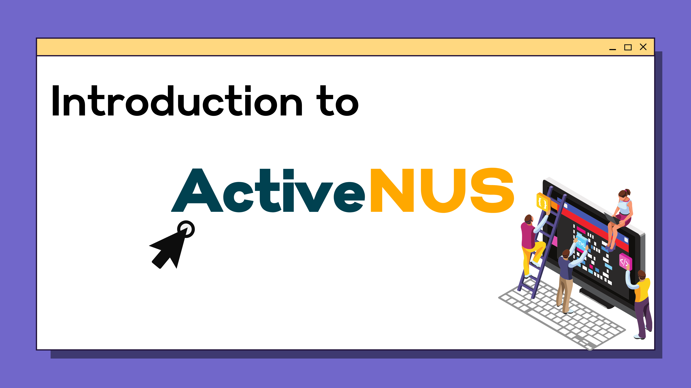](https://youtu.be/ZSS92-gmpTY){:target="_blank"}

## 3.2 Demo Video
[](https://youtu.be/QgBkij0k48A){:target="_blank"}


# 4. Proposed Level of Achievement
Apollo 11

# 5. Motivation
A lot of students, especially university/college students, have frequent problems with study planning. They end up panicking, don’t know where to begin, and finally do not prepare well, which is the main reason for bad performances in tests and examinations.

Some are able to plan their study using available timetable-making applications in the market. However, few of these tools actually know what users need, and most of them are not optimal for learning management. Why isn’t there a tool that can help you keep track of your learning process and plan your study in a productive way?

# 6. Value Proposition
We hope to make a website that helps users, especially students, plan for work and study in general and promotes efficient study methods, namely active recall and spaced repetition.

The science behind active recall and spaced repetition:
* Active recall is the process of actively drawing information from your memory. It is a proven efficient way of moving knowledge from short-term to long-term memory compared to traditional passive revision, namely rereading, highlighting, etc. 
* Spaced repetition entails spacing the revision of the topics at specific intervals over time, which is proven to be beneficial by the 'forgetting curve.' We can take advantage of the forgetting curve by breaking the cycle by reviewing material at spaced intervals. The more we practice and the more spaced this repetition becomes, we will likely encode this information into our long-term memory.

How is active recall and spaced repetition incorporated into ActiveNUS:
* Calendar: our calendar has a built-in schedule recommendation feature based on the logic of spaced repetition and forgetting curve, helping students plan their studies more efficiently. 
* Flashcards:
  * Active recall is highly encouraged by flashcards. Flashcard is an effective and fun strategy for students to test themselves and utilize their cognitive power more actively
  * Spaced repetition: our flashcard module employs an algorithm that automatically renders a sequence of flashcards based on users’ feedback. The time interval between studying each flashcard will be optimized by the spaced repetition method.

# 7. How are we different from state-of-the-art platforms?

## 7.1 Google Calendar: 
The Calendar application of ActiveNUS has a recommendation system based on active recall and spaced repetition. The users will be provided the most effective study schedule.

## 7.2 Quizlet: 
Our flashcard system employs an underlying algorithm to sort items according to users’ familiarity with their contents.

## 7.3 Pomofocus: 
Our Pomodoro module is not a stand-alone count-down timer, but a useful part of a highly interconnected system. Each successful focus cycle is recorded and updated automatically to the Calendar module.

# 8. Tech Stack
Frontend
* HTML/CSS/JavaScript
* VueJS

Backend & Database
* Python
* Django
* SQLite

Server Deployment
* Heroku

# 9. Set Up Instruction

Change into the directory you want to store the code (the directory must not contain any non-empty directory named `ActiveNUS`).

Clone the codebase by `$ git clone https://github.com/nvbinh15/ActiveNUS.git`

A new `ActiveNUS` directory will be created in the current directory.

Change into the `ActiveNUS` directory.

Directory structure:

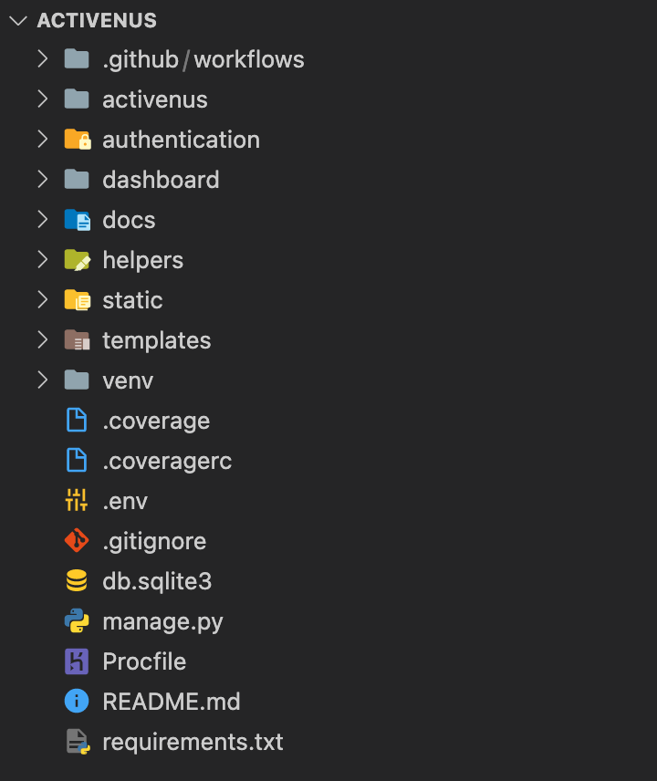

Create a virtual environment with `python3` by running `$ virtualenv -p python3 venv`. A new directory called `venv` will be created in the current directory.

Activate the `venv` environment by running `$ source venv/bin/activate`. You are now switching to the `venv` environment.

Install all the required packages by running `$ pip install -r requirements.txt`

The following packages will be installed into the current environment (`venv`):

|Package|Version|
|-------|-------|
|`appdirs`|1.4.4|
|`asgiref`|3.3.4|
|`certifi`|2020.12.5|
|`chardet`|4.0.0|
|`distlib`|0.3.1|
|`dj-database-url`|0.5.0|
|`Django`|3.2.3|
|`django-heroku`|0.0.0|
|`firelock`|3.0.12|
|`gunicorn`|20.1.0|
|`heroku`|0.1.4|
|`idna`|2.10|
|`pipenv`|2021.5.29|
|`python-detautil`|1.5|
|`pytz`|2021.1|
|`requests`|2.25.1|
|`six`|1.16.0|
|`sqlparse`|0.4.1|
|`urllib3`|1.26.5|
|`validate-email`|1.3|
|`virtualenv`|20.4.7|
|`virtualenv-clone`|0.5.4|
|`whitenoise`|5.2.0|

Create a new file `.env` in the current directory that stores all the environment information. Type in your secret key (django secret key), your email address, and your email password. The content of the file should be like this:

```
export SECRET_KEY=’<YOUR_SECRET_KEY>’
export EMAIL_FROM_USER=<YOUR_EMAIL_ADDRESS>
export EMAIL_HOST_PASSWORD=<YOUR_EMAIL_PASSWORD>
```

Activate the `.env` file by running `$ python manage.py runserver`

Now, everything is set up. You can run the website locally by `$ python manage.py runserver`. The local server deployment should be found at [http://127.0.0.1:8000/](http://127.0.0.1:8000/).

```
Watching for file changes with StatReloader
Performing system checks...

System check identified no issues (0 silenced).
July 01, 2021 - 15:07:06
Django version 3.2.3, using settings 'activenus.settings'
Starting development server at http://127.0.0.1:8000/
Quit the server with CONTROL-C.
```


# 9. Target User Profile
* Users who prefer managing their schedule digitally
* Students approaching exam period
* Students who want to incorporate active recall and spaced repetition methods into their studying routines
* Students who want to use effective revision methods
* Users who want to have a platform to share and learn from the others

# 10. User Stories

| As a ... | I want to ... | So that I can ... |
|----------|---------------|-------------------|
|user|have a highly interconnected work/study management tool|easily navigate around the workspace and not be bothered by mundane administrative tasks|
|student|get recommendations on effective revision schedule|ncorporate active recall and spaced repetition methods into their studying routines|
|user|organize my tasks, keep track of work/study progress|manage my time effectively|
|user|use Pomodoro timer while working and studying|avoid distractions and work/study with the optimal productivity|
|student|create flashcards based on the topic I have studied and use them later on|revise effectively|
|user (especially student)|use my time effectively with a Pomodoro timer and get rewards|avoid being distracted while working and studying|
|users|write posts in the forum, see the others’ posts, chat with my friends within the ActiveNUS community|share my schedule, learning tips, and learn from the others|
|administrator|identify abusers, warn them and ban them if they continue to cause problems|prevent abuse of the system|

# 11. Overall Design

We aim to make a website that helps users, especially students, plan for work and study in general and promotes efficient study methods, namely active recall and spaced repetition. To achieve this goal, we came up with the overall design for ActiveNUS.

## 11.1 Core Features

**Dashboard:** a comprehensive overview of your work/study progress and daily tasks 

**Calendar:** help you plan and track your studies with built-in active recall and spaced repetition logic.
* Export iCalendar file so that users can sync with other platforms (e.g. Google Calendar)
* User-friendly GUI to add a study session and categorize it based on modules or topics
* Tracking is enhanced by options to evaluate the studying session (how familiar the user is with the topic after revising).

**User account and Social Forum:** which user can create to save their progress and calendar and interact with friends
* Find friends on ActiveNUS
* Write posts in the forum, react and comment on the others’ posts

**Pomodoro timer:**
* A timer that runs for a default period of 25 minutes focus time and 5 minutes break (user has the option to make adjustment). 
* Each successful studying cycle will be recorded into the tracking calendar. Most of the administrative work is automatically done for the users.
* Send a notification at the system level (when the user is navigating outside the website)
* Users will be rewarded for each successful attempt.

**Flashcards systems:** Flashcard is an indispensable component of the active recall studying method
* Create folders of flashcards based on the topic you are studying for. 
* Accessing the flashcards folder for the topic or module directly from the dashboard

## 11.2 User Interface Design
ActiveNUS’s main target users are students and young people. Therefore, we choose a modern design language for the platform. Furthermore, we also promote simplicity in design, helping users get the best experience of learning and working with ActiveNUS.

The UI style guide and prototypes are included below.


&nbsp;

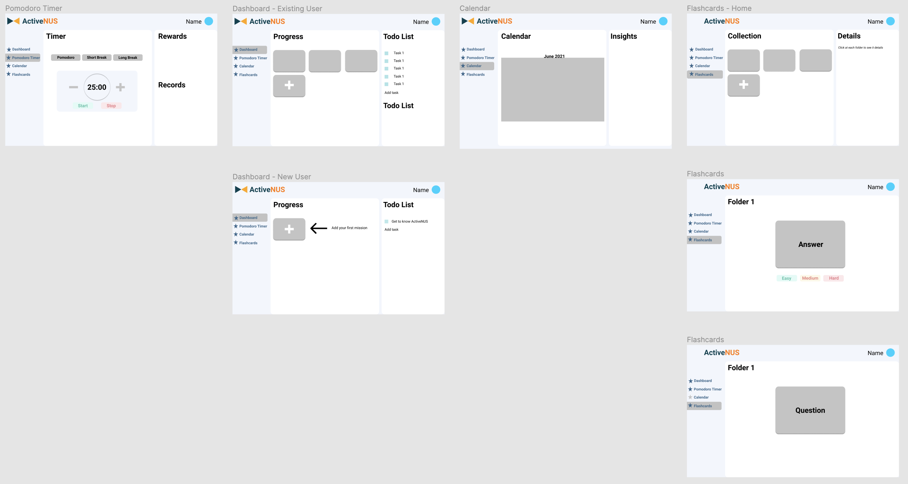


# 12. Program Flow

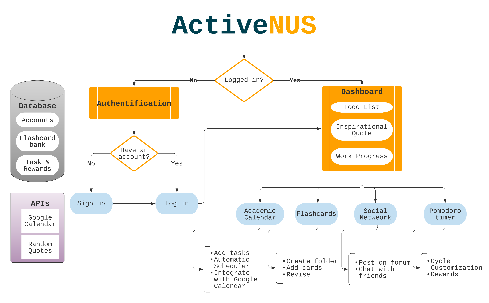


# 13. Project Scopes
The project is broken down into 3 parts corresponding to 3 milestones.

## 13.1 Milestone 1: Setting up authentication and administration

13.1.1 Set up application components (Authentication, Dashboard, Admin)

13.1.2 Frontend Web Routing: Set up URLs for the components of the applications 

```python
from django.contrib import admin
from django.urls import path, include
from django.conf.urls.static import static
from django.conf import settings

urlpatterns = [
    path('admin/', admin.site.urls),
    path('auth/', include('authentication.urls')),
    path('', include('dashboard.urls')),
    path('accounts/', include('django.contrib.auth.urls')),
]
```

13.1.3 Set up Database using SQLite3. Models and data are stored in db.sqlite3 file.

13.1.4 Set up administration: using Django default admin app and creating a superuser.

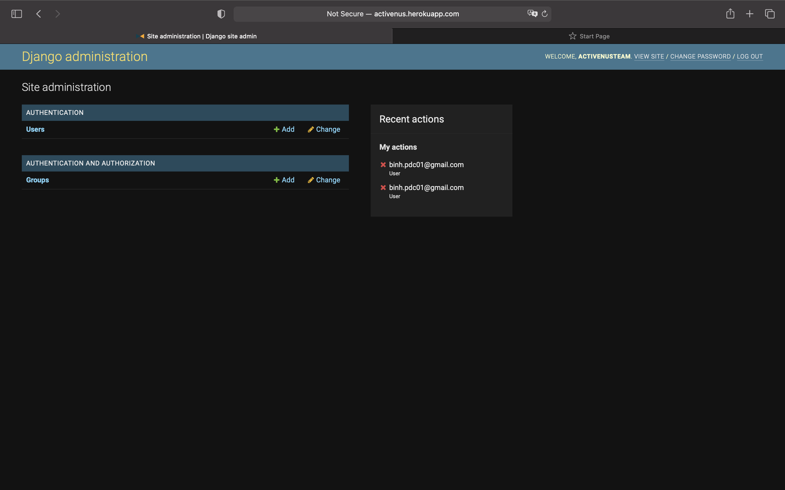

13.1.5 Token Authentication: implement user registration and login. Users will be able to register (email verification required), and upon logging in, are authenticated and assigned a token, their password will be hashed (instead of being stored as plain text directly).

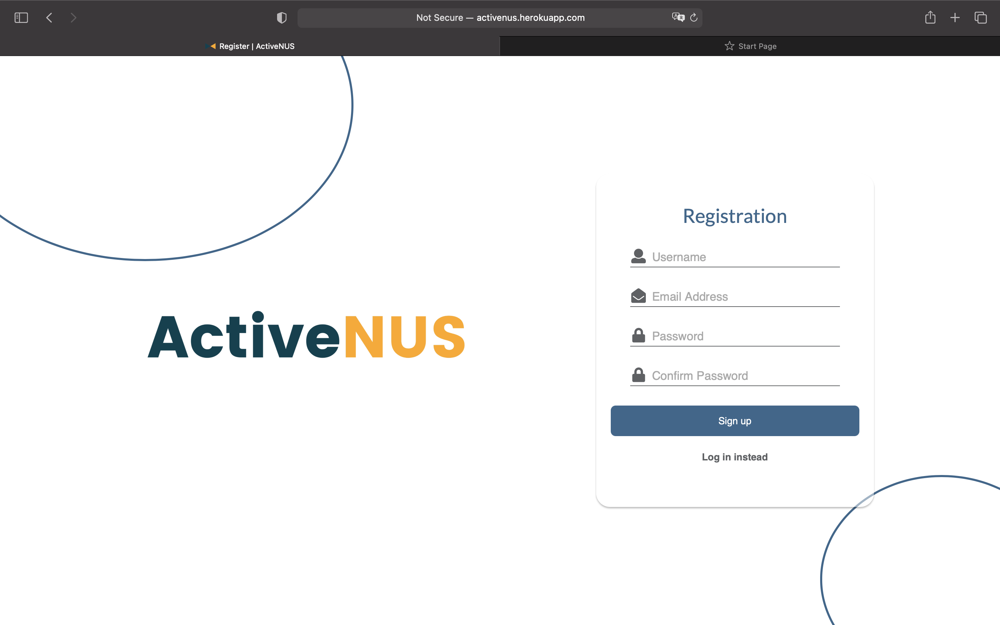

## 13.2 Milestone 2: Building the core

### 13.2.1 Dashboard

#### Description

When a user is successfully logged in, he/she is taken to a dashboard page, which displays a comprehensive overview of the user's long-term progress and daily to-do list. Users are able to manually add/delete tasks and sort tasks according to their states. 

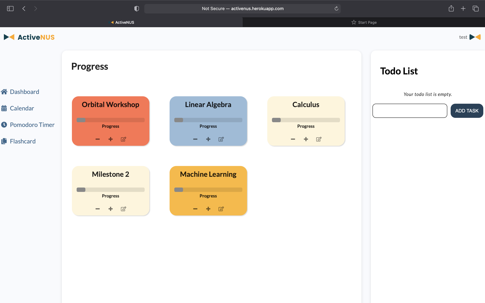

#### Consideration

To-do list design consideration: On using to-do list, users might want to keep track of finished items but not delete them immediately. Therefore, we separate the remove button, which is minimally stylized as a trashcan and the finish toggle button.

Additionally, users can also have an option to move finished tasks to the end. This will be very helpful because in real-life usage, the order users add tasks and finish them are not the same. Hence, users can easily see at a glance which are the undone and done tasks separately. 

### 13.2.2 Pomodoro timer

#### Description

Users can navigate to the Pomodoro timer module with the navigation bar on the left. Pomodoro timer can now be used as a stand-alone feature. Users can simply press start and the timer will run for a default amount of 25 minutes. After 25 minutes of working, the user will move on to break mode. 

The focused time is recorded into local storage for future development. 

If the user wants more focus or break time, he/she can easily adjust with plus/minus buttons next to the countdown clock. The maximum time is set at 90 minutes and the minimum is 5 minutes.

After each cycle, the user receives a notification via the browser.

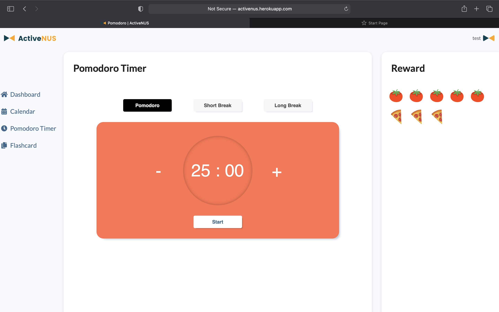

#### Consideration

At first our Pomodoro timer is designed with 4 buttons according to 4 different modes. The time designated for each mode is fixed at 25 minutes, 5 minutes and 15 minutes. This may cause irritation for users who want to change the focus and break time according to their needs.

Also, the 4 buttons structure in our first prototype are not intuitive for new users. Specifically, on their first encounter, without instruction, users may take a while to figure out which button corresponds to which mode and how to start a focus cycle.

Hence, in our second prototype, we replace the 4 buttons structures with a simple and intuitive start/stop toggle button and 3 buttons corresponding to 3 different modes to choose from. Furthermore, to increase more control for users, we include the plus and minus buttons for users to customize their cycle.

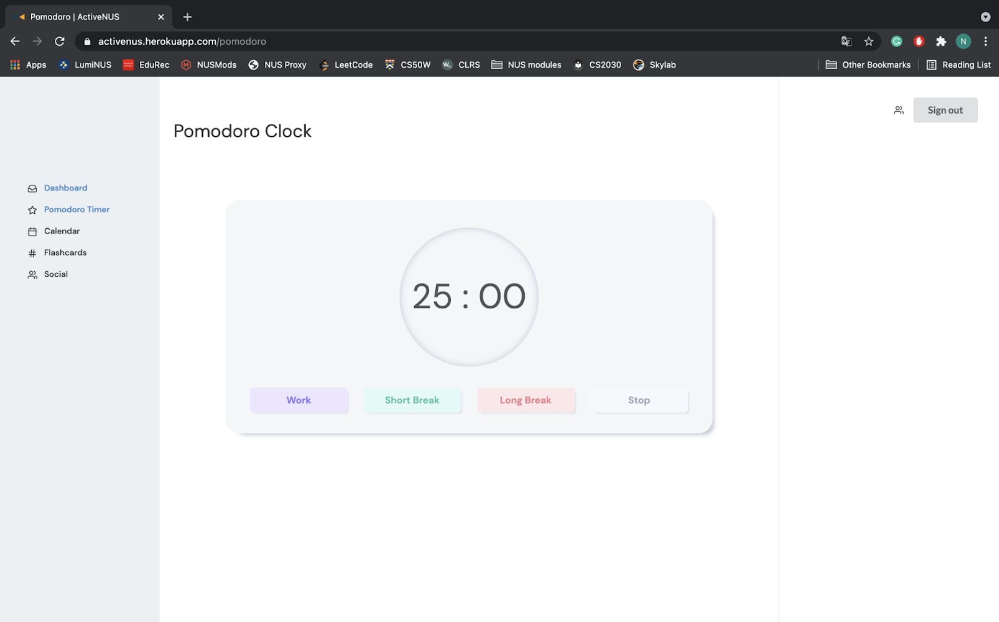

### 13.2.3 Calendar

#### Description

Apart from viewing daily tasks and long-term progress, users can view their schedule more comprehensively in terms of date by navigating to their calendar.

Users now can add, drag and drop to update and delete events. Users can have different view modes to cater for their needs: monthly, weekly and daily view.

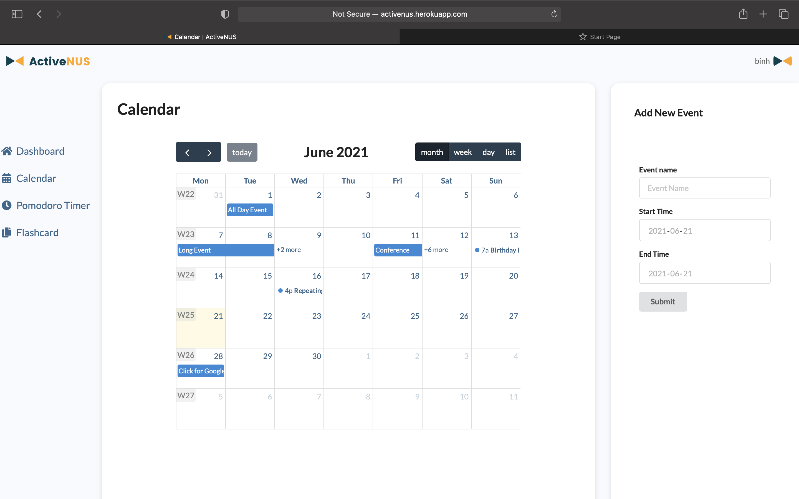

#### Consideration

On view the calendar, users might want to view their schedule for the whole month or their daily detailed events. We take this into account during designing the calendar module so that users can easily navigate between different view modes (month, week and day) by using a button cluster on the top right.

Users can navigate easily between previous/next month, week or day using the 2 arrows on the top left. Also, users might want to immediately return to today’s date, hence, we add a ‘today’ button next to the arrow buttons.

### 13.2.4 Flashcard

#### Description

Users can choose to revise newly learned concepts with flashcards. Currently, there is a default deck of Greek gods. Users can add their own cards by using the form beneath.

New cards and the number of times users have visited each card are currently saved to the local storage of users’ browsers.

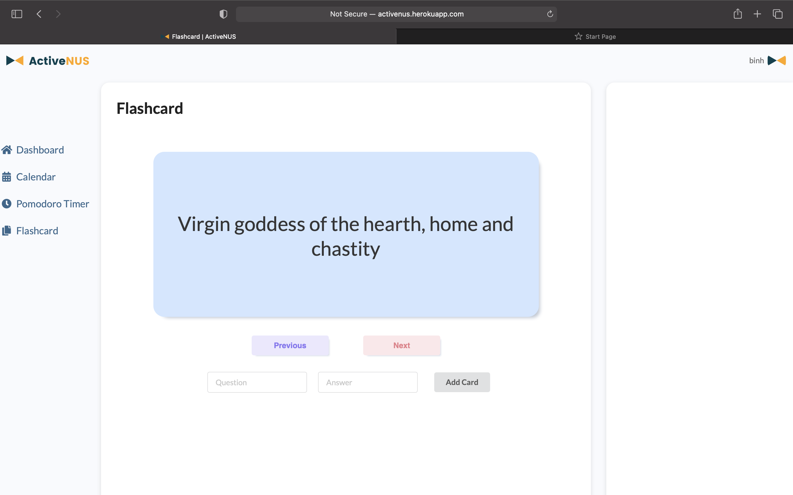

#### Consideration

To replicate a real flashcard, we use flipping animation that occurs when users click on anywhere on the card.

Previously, we did not allow users to add cards to the card set while in learning mode. However, doing so may affect the user's workflow. Therefore, we came up with the current implementation.

### 13.2.5 Route protection

Unauthorized users can only access the Authentication and Registration system. Similarly, logged-in users can only view Dashboard, Calendar, Pomodoro Timer, and Flashcard before signing out.


# 14. Testing

Django provides a test framework with a hierarchy of classes that build on the Python standard unittest library. Django has a default `test.py` file for each application of the project. 

However, to cope with the complexity of the website and a large number of views and models created (and to be created), we write two separate files `test_views.py` and `test_models.py`, which are stored in the tests directory of each application instead.

## 14.1 View Testing

We want to ensure that the views of each application are handled correctly. To do that, test functions are written to check the template rendering, the HTTP status codes and assert the messages to the client. 

The testing functions are created under the `TestViews` class, which is inherited from the `TestCase` class of `django.test`. The test view functions include:

* Authentication view tests
  * Register page
  * Login page
  * Should / should not sign up user
  * Should / should not login user
* Dashboard view tests
  * Home page
  * Calendar page
  * Pomodoro Timer page
  * Flashcards page

Details of the implemented tests are included in the table below.

| ID | Name | Inputs | Expected Outputs | Result |
|----|------|--------|------------------|--------|
|1|Register page|`response = self.client.get(reverse('auth_register'))`|`response.status_code == 200; templateUsed == “authentication/register.html”`|Pass|
|2|Login page|`response = self.client.get(reverse('auth_login'))`|`response.status_code == 200; templateUsed == “authentication/login.html”`|Pass|
|3|Sign up user|`self.user = {"username":"username", "Email": "email@hmail2.com", "password1": "password”, "password2": "password"}`|`response.status_code == 302`|Pass|
|4|Not sign up user with taken username|`self.user = {"username": "username", "email": "email@hmail2.com", "password1": "password", "password2": "password"}; self.client.post(reverse("auth_register"),self.user); response = self.client.post(reverse("auth_register"),self.user)`|`response.status_code == 409; response.wsgi_request.message == “Username is taken, choose another one”`|Pass|
|5|Not sign up user with taken email|`self.user = {"username": "username1", "email": "email@hmail2.com", "password1": "password", "password2": "password" }; self.test_user2 = {"username":"username11", "email": "email@hmail2.com", "password1": "password", "password2": "password"}`|`response.status_code == 409`|Pass|
|6|Not sign up user with mismatch password|`self.user = {"username": "username3", "email": "email@hmail3.com", "password1": "password3", "password2": "password33"}; response = self.client.post(reverse("auth_register"), self.user)`|`response.status_code == 409; response.wsgi_request.message == “Password mismatch”`|Pass|
|7|Home page redirect login|`response = self.client.get(reverse('home'))`|`expected_url == '/auth/login?next=/'; status_code == 302; target_status_code == 200; msg_prefix == ''; fetch_redirect_response == True`|Pass|
|8|Calendar redirect login|`response = self.client.get(reverse('home'))`|`expected_url == '/auth/login?next=/calendar'; status_code == 302; target_status_code == 200; msg_prefix == ''; fetch_redirect_response == True`|Pass|
|9|Pomodoro redirect login|`response = self.client.get(reverse('home'))`|`expected_url == '/auth/login?next=/pomodoro'; status_code == 302; target_status_code == 200; msg_prefix == ''; fetch_redirect_response == True`|Pass|
|10|Flashcard redirect login|`response = self.client.get(reverse('home'))`|`expected_url == '/auth/login?next=/flashcard'; status_code == 302; target_status_code == 200; msg_prefix == ''; fetch_redirect_response == True`|Pass|


## 14.2 Model Testing

The User class is inherited from the `AbstractUser` class of `django.contrib.auth.models`. The test function is written under the `TestModel` class (inherited from the `TestCase` class of `django.test`). It checks whether the user can be created correctly and asserts the matching of user information

```python
from authentication.models import User
from django.test import TestCase

class TestModel(TestCase):

    def test_should_create_user(self):
        user = User.objects.create_user(
                username='username', 
                email='email@app.com',
            )
        user.set_password('password123')
        user.save()

        self.assertEqual(str(user), 'email@app.com')
```

In the example above, the `test_should_create_user` creates a new testing user with `username = ‘username’` and `email = ‘email@app.com’`. Then, it then checks if this information is stored correctly in the database and its string representation is correct or not.

## 14.3 Running Tests

To run tests, run the command `$ python manage.py test`.

A test database will be created so that the main database will not be affected. The program will report the bugs detected, the run time, and the overall status. Finally, the test database will be destroyed.

```
Creating test database for alias 'default'...
System check identified no issues (0 silenced).
.......
----------------------------------------------------------------------
Ran 7 tests in 1.157s

OK
Destroying test database for alias 'default'...
```

## 14.4 User Acceptance Testing

When the prototype for ActiveNUS is ready, acceptance testing will be conducted. The sample size for acceptance is projected to be 50, composed of our target users which are university students.

We intend to inquire testers on the following features:

#### Authentication
* Is it easy and intuitive to navigate to the registration page for new users?
* Is it easy and intuitive to log in for existing users?
* If the users fail to provide valid credentials on logging in, do users face any difficulties setting up a new password?

#### Dashboard and To-do list
* Is the user interface of the dashboard and to-do list clear and comprehensive on users’ tasks and progress?
* Do users face any inconveniences while viewing their progress boxes?
* Do users face any inconveniences to add, track and delete to-do list tasks?

#### Calendar
* Do users face any inconveniences to add, update and delete calendar events?
* Is it easy and intuitive for users to view different viewing modes of the calendar (monthly, weekly and daily view)?
* Do users face any other inconveniences while using the calendar?

#### Pomodoro timer
* Is it easy and intuitive for users to choose different modes of Pomodoro timer (focus mode, short break mode, long break mode)?
* What do users think of the notification? Is the volume suitable for a working/studying environment? 
* What do users think of the gamified reward scheme? Is it exciting enough to motivate users?

#### Flashcard
* Do users face any inconveniences when adding new cards and using existing card decks?
* Are the animation and user interface pleasant to use?
* Are the automatically recommended cards really the ones that users need to reinforce?


# 15. Software Security Measures

To ensure the safety of our database and the privacy of users, we introduced some security measures.

## 15.1 CSRF Token

A CSRF (Cross-site request forge) token is a unique, secret, unpredictable value generated by the server-side application and transmitted to the client so that it is included in a subsequent HTTP request made by the client. When the later request is made, the server-side application validates that the request consists of the expected token and rejects the request if the token is missing or invalid.

CSRF tokens can prevent CSRF attacks by making it impossible for an attacker to construct a fully valid HTTP request suitable for feeding to a victim user. Since the attacker cannot determine or predict the value of a user's CSRF token, they cannot construct a request with all the necessary parameters for the application to honor the request.

In ActiveNUS, POST requests are used in the registration system and other forms for users to add the information. Therefore, CSRF tokens are used to protect the database of unwanted threats.

## 15.2 Password Hashing

If the user's password is stored as plaintext in the database, the system can be put at risk by unwanted attacks. Moreover, user privacy may be violated if necessary practices are not taken. Therefore, we hash people's passwords using SHA265 algorithm with 260,000 iterations and salt added.

A hash is a ‘one-way’ cryptographic function, and the output of hashing has a fixed size for any size of the source text. A good hash function should map the expected inputs as evenly as possible over its output range. That is, every hash value in the output range should be generated with roughly the same probability. Also, a very small change of the input should lead to a significant variation of the output. 

We choose SHA256 to protect users’ passwords because it satisfies all properties of a good hash function as mentioned above. To enhance security, we run the hash function through 260,000 iterations with salt (adding random bits to each password instance before hashing).


# 16. Software Design Patterns and Principles

## 16.1 Single Level of Abstraction Principle (SLAP)

The Single Level of Abstraction Principle statement is that “each method should be written in terms of a single level of abstraction”.

Switching between levels of abstraction makes code harder to read. Reading the code requires you to mentally create the missing abstractions by looking for groupings of statements that belong together.

Therefore, we choose to follow this principle to make the process of writing, understanding, and debugging easier. 

For example, in `/helpers/decorators.py`, the `auth_user_should_not_access` function is abstracted and used as decorators in `/authentication/views.py` although we can achieve the same features using conditional statements.

```python
from django.contrib.auth.decorators import user_passes_test

def check_user(user):
    return not user.is_authenticated

user_logout_required = user_passes_test(check_user, '/', None)

def auth_user_should_not_access(viewfunc):
    return user_logout_required(viewfunc)
```

## 16.2 Don’t Repeat Yourself (DRY) Principle

This is one of the core design philosophies of Django. “Every distinct concept and/or piece of data should live in one, and only one, place. Redundancy is bad. Normalization is good. The framework, within reason, should deduce as much as possible from as little as possible.”

We choose to follow this principle in order to make our code more maintainable and reusable.

For example, since most of the components of ActiveNUS have the same design language, we write a `base.html` file in `/templates/_partials` that define the structure of the pages, and the other templates extend that file.

```html
  
    
    <div id="main-part" class="ui grid" style="height: 100%">
        <div class="two wide column" id="left-div">
            <div class="div-content" id="left-div-content">
                <a href=>
                    <div class='tab'><i class="home icon"></i> Dashboard</div>
                </a>
                <a href=>
                    <div class='tab'><i class="calendar alternate icon"></i> Calendar</div>
                </a>
                <a href=>
                    <div class='tab'><i class="clock icon"></i> Pomodoro Timer</div>
                </a>
                <a href=>
                    <div class='tab'><i class="copy icon"></i> Flashcard</div>
                </a>
            </div>

        </div>
        <div class="ten wide column" id="mid-div">
            <div class="div-content" id="mid-div-content">
                

                
            </div>
        </div>

        <div class="four wide column" id="right-div">
            <div class="div-content" id="right-div-content">
                

                
            </div>
        </div>
    </div>

  

    

    

  
```


# 17. Software Engineering Practices

## 17.1 Virtual Environment

A virtual environment is a Python environment in which the Python interpreter, libraries, and scripts installed are isolated from those installed in other virtual environments, as well as (by default) any libraries installed in a “system” Python, that is, one that is installed as part of the operating system.

We used virtualenv to create a virtual environment (`venv`) so that all the dependencies are controlled and not affected by any other projects/tasks running locally on our computer. Furthermore, by isolating the libraries, the process of deployment also becomes easier.

## 17.2 Version Control

We use GitHub as the Git repository hosting for development and version control for ActiveNUS. GitHub allows us to manage the workflow and make sure the project is on schedule with GitHub Issues, Pull Requests, and GitHub Actions.

* GitHub Issues: We use GitHub Issues not only to report bugs but also to collect user feedback and organize the tasks to be implemented.

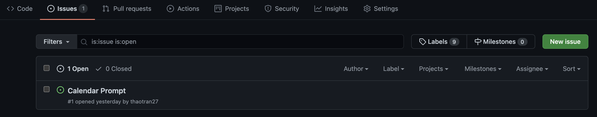

* Pull request workflow:
  * A collaborator starts by checking out a new branch and doing all the work for a specific task on that branch. To signal the other about that new branch, the collaborator push it to GitHub.
  * Every time an important part of the task is implemented, the collaborator will make a new commit with a descriptive commit message.
  * After finishing that task, the collaborators will commit and push that branch and create a pull request through GitHub’s UI.

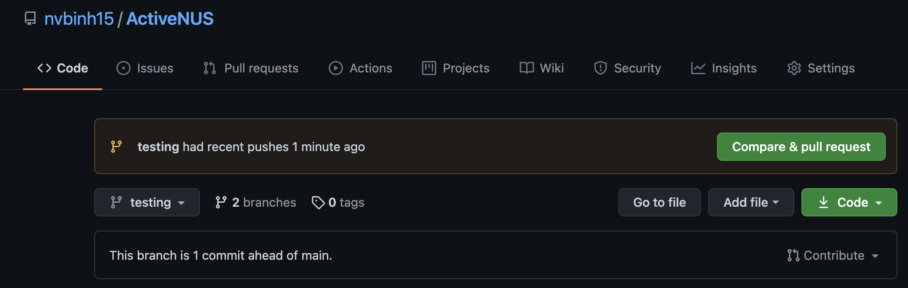

  * Both collaborators will then review the code and test it by running tests and deploying that branch.
  * If every requirement is satisfied, we will merge that branch with the main branch and deploy the main branch again with the newly implemented features.

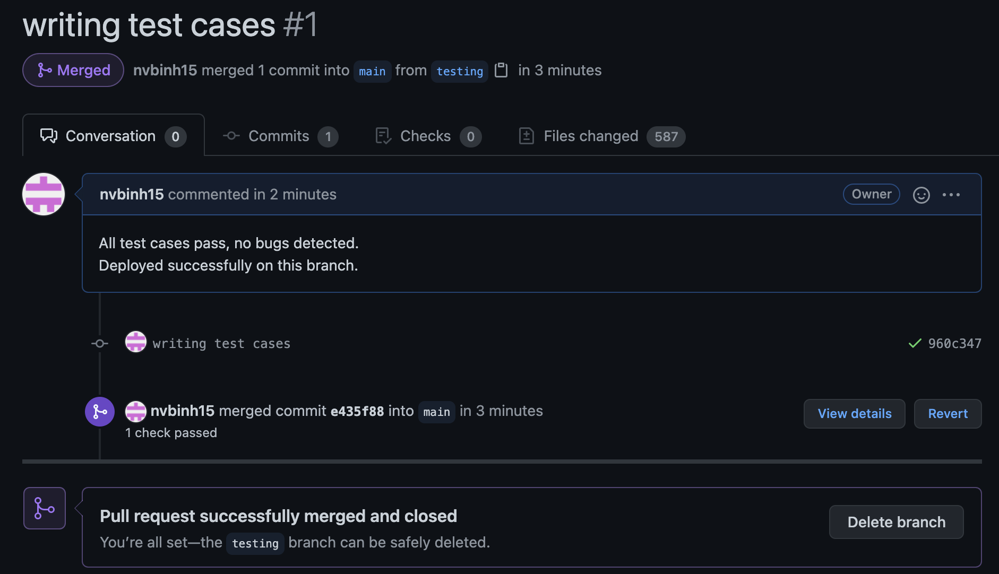

* GitHub Actions (to be mentioned in CI/CD)


## 17.3 Continuous Integration / Continuous Delivery (CI/CD)

Continuous integration and continuous delivery are set up using Github action.

GitHub Actions allows collaborators to construct workflows where certain actions can be specified to be performed every time someone pushes to a git repository.

Since Heroku (deployment platform) is connected to Github, the website will be automatically deployed after every push if that push passes all the tests and requirements. If not, then it will be evaluated manually by the collaborators.
