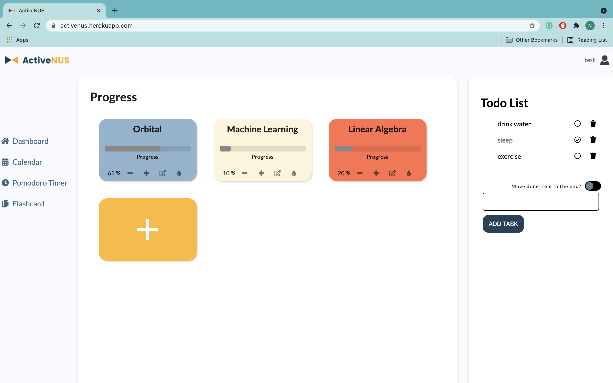
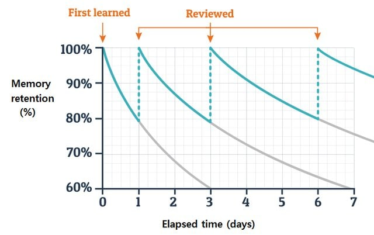
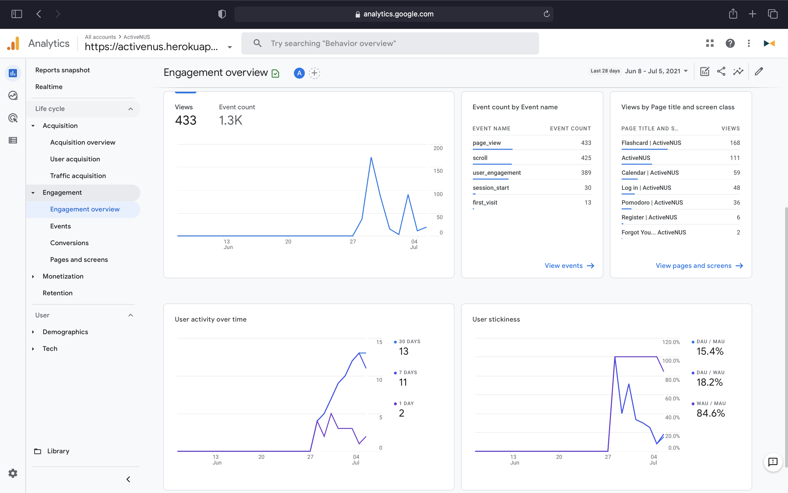

# Proposed Deliverables for Milestone 3
---

# Table of Contents

1. [Timeline](#1-timeline)
2. [Core Features](#2-core-features)\
  2.1 [Dashboad](#21-dashboard)\
    &nbsp;&nbsp;&nbsp;&nbsp;2.1.1 [Progress tracking](#211-progress-tracking)\
    &nbsp;&nbsp;&nbsp;&nbsp;2.1.2 [To-do List](#212-to-do-list)\
  2.2 [Pomodoro Timer](#22-pomodoro-timer)\
    &nbsp;&nbsp;&nbsp;&nbsp;2.2.1 [Countdown Clock](#221-countdown-clock)\
    &nbsp;&nbsp;&nbsp;&nbsp;2.2.2 [Reward](#222-reward)\
  2.3 [Calendar](#23-calendar)\
    &nbsp;&nbsp;&nbsp;&nbsp;2.3.1 [Calendar Module](#231-calendar-module)\
    &nbsp;&nbsp;&nbsp;&nbsp;2.3.2 [Recommendation System](#232-recommendation-system)\
  2.4 [Flashcard](#24-flashcard)\
    &nbsp;&nbsp;&nbsp;&nbsp;2.4.1 [Flashcard System](#241-flashcard-system)\
    &nbsp;&nbsp;&nbsp;&nbsp;2.4.2 [Algorithm to Optimize Flashcard Order](#242-algorithm-to-optimize-flashcard-order)\
  2.5 [Social Forum](#25-social-forum-depends-on-the-progress)
3. [Database](#3-database)
4. [Testing](#4-testing)\
  4.1 [Automated Testing](#41-automated-testing)\
  &nbsp;&nbsp;&nbsp;&nbsp;4.1.1 [Django Unit Testing](#411-django-unit-testing)\
  &nbsp;&nbsp;&nbsp;&nbsp;4.1.2 [Authoring Functional Tests Using Selenium](#412-authoring-functional-tests-using-selenium)\
  4.2 [User Acceptance Testing](#42-user-acceptance-testing)
5. [Analytics](#5-analytics)


# 1. Timeline

Our timeline for milestone 3 includes 3 phases:

## 1.1 Phase 1

Time: 29 June - 15 July

Objectives:
* Implement core features
* Implement automated testing
* Set up Google Analytics

## 1.2 Phase 2

Time: 16 July - 20 July

Objectives:
* Perform user acceptance testing
* Collect data from Google Analytics

## 1.3 Phase 3

Time: 21 July - 15 July

Objectives:
* Perform necessary adjustment based on users' feedback (user acceptance testing) and data from Google Analytics
* Final modifications
* Making demo video, finalize documentation


# 2. Core Features

## 2.1 Dashboard

### 2.1.1 Progress tracking

#### Description

* User’s progress is displayed on the dashboard with each of their project and plan as one individual card. 
* User will be able to view immediately their progress quantitatively with a visualized progress bar and increase or decrease easily with the `+` and `-` buttons.
* User can edit their progress card name.



#### Implementation

* Client-side: write a VueJS component for each of the progress card that includes the following attributes:
  * `title` (string)
  * `progress` (integer)
  * `duration` (datetime)
  * `tag` (string)
* Write a Django model that has the same attribute as the VueJS component. The sever-side data will be updated calling a Django view function asynchronously (Ajax) using Vue.

### 2.1.2 To-do List

#### Description

* Users are able to have more options to customize their task: they can add a task tag (school, work, networking,...) and specify the level of urgency. The tags and level of urgency will be displayed beside the task title. Users will benefit from this feature in the sense that they will know which task needs finishing first and not get overwhelmed.
* Connect client-side and server-side data: currently, users are able to interact with the todo list, but data will be refreshed after each session. By the end of milestone 3, the to-do list will be bind to the user with the one-to-many relationship.

#### Implementation

* Expand the current `todolist` object (add tag and the level of urgency attributes).
* Write a Django model that has the same attribute as the `todolist` object. The server-side data will be updated by calling a Django view function asynchronously (Ajax) using Vue.


## 2.2 Pomodoro Timer

### 2.2.1 Countdown Clock

#### Description

* Current approach to focus cycle tracking: Currently, when the current mode is Pomodoro (focus) mode, if users stop the countdown clock, they might adjust the focus time using `+` and `-` buttons then resume. As a result, users can cheat to get their rewards, which might counteract the aim of the reward scheme.
* New way of cycle tracking: When users top the countdown clock in Pomodoro mode, they will have 2 options: `resume` and `restart`. Additionally, when in Pomodoro mode, users are unable to adjust the time using `+` and `-` buttons. If users choose to restart, they can start a new cycle, adjust the time to their liking, but the old cycle will be completely lost. This approach will motivate users to complete their current cycle and ban them from cheating.
* Overview/tracking cycle count: A comprehensive overview of the usage of the Pomodoro timer will be displayed to the user, which will give the user a broad view of their work/study.

#### Implementation

* Add new `resume` and `restart` buttons and bind their condition of appearance using VueJS.
* Write a Django model `Cycle` that has the following attributes `cycleCount`, `duration`, and `dateTime` to store the focus time into the database.

### 2.2.2 Reward

#### Description

* There will be a reward for each week, which is a random hidden picture. The picture will be revealed piece by piece based on the total focus time of the user.
* Users will also be able to see their progress in detail with a visualized dynamic progress bar.
* This will gamify the pomodoro module and motivate users to focus more.


#### Implementation

* The total focus time of the user will be stored in the database. The picture with the exact hidden pieces will be rendered based on that focus time.
* The total time focus bar is a Vuejs component bind with asynchronous data fetch from Django backend.

## 2.3 Calendar

### 2.3.1 Calendar Module

#### Description

* Users can connect their calendar with Google Calendar, they can export their existing schedule or sync ActiveNUS calendar and Google Calendar.
* Users can also export their schedule to `.ics` file so that they can import it to many other different calendar applications.

#### Implementation

* Call API from Google Calendar API to sync and read data from Google Calendar
* We are considering using `django-ical` or `ics` package to export `.ics` files.

### 2.3.2 Recommendation System

#### Description

* Within the calendar module, users have a choice to create a new progress, which will be reflected on the dashboard page. 
* Users can choose to or not to authorize ActiveNUS to automatically render a schedule, which will be based on the expected workload and expected number of iterations using active recall and spaced repetition logic


#### Implementation

The algorithm to generate schedules automatically will be written based on Ebbinghaus’ forgetting curve and review cycle. ActiveNUS will also have conditions to restrict the input data (for example end date must be at least 2 days after the start date, or the number of iterations must fall into some range based on the expected workload input,...). Based on the input data, ActiveNUS will generate calendar events.



*Ebbinghaus' forgetting curve and review cycle.*

## 2.4 Flashcard 

### 2.4.1 Flashcard System

#### Description

* Organizing flashcards by folder. Users will be able to see the number of items in each folder to have a broader overview of the subject. They can also add a new folder with the description on this page.
* For each folder, users have the option to edit and learn the topic


#### Implementation

* Create a new page to display folders.
* Each folder will have a specific view page with a parameter which is the `id` of the folder and will be handled by `django.urls`.

### 2.4.2 Algorithm to Optimize Flashcard Order

#### Description

* Instead of the option to go to the next or previous card, users will be asked about their familiarity with the item.
* The next flashcard will be rendered based on their level of familiarity with the topic.


#### Implementation

Each card has score and number_of_attempts attributes. After each attempts, these attributes will be updated with the formula:

```python
score = (score * number_of_attempts + n) / (number_of_attempts + 1)

number_of_attempts = number_of_attempts + 1
```

With `n` equals `1`, `2`, or `3` if the user clicks on `Hard`, `Medium`, or `Easy`, respectively.

The items in a folder are sorted by the score and displayed to the user in ascending order of score.

## 2.5 Social Forum (depends on the progress)

#### Description

* Find friends on ActiveNUS
* Write posts in the forum
* Comment on the others’ posts

#### Implementation

* Finding friends can be implemented by a database query.
* Writing posts and commenting functionalities will be handled by POST request and rendered to the website by a Vue model.


# 3. Database

Currently, data is stored in local storage, except Users’ profiles are stored in SQLite3 database (server-side). By milestone 3, we will store all the data in the server-side database.

In addition, we are considering using PostgreSQL to store and manage data for the final product instead of SQLite3 since PostgreSQL is more compatible with Heroku and can manage a larger amount of data.


# 4. Testing

## 4.1 Automated Testing

### 4.1.1 Django Unit Testing

Along with completing the main components, we also write test functions for features with the same approach taken in milestone 2 using `django.test` module.

The tests include:

* Checking models (valid methods and attributes)
* Checking client-side (assert the HTTP status codes and the messages to the client)
* Checking logic (the algorithms of schedule suggestion and rendering flashcards to the users based on their level of familiarity with the topic)

### 4.1.2 Authoring Functional Tests Using Selenium

Since ActiveNUS consists of many components, it is difficult to test the client-side code manually. Therefore, we will use Selenium WebDriver, which is a collection of open-source APIs, to automate the testing of the web application.

To use Selenium and ChromeDriver, we need to install these 2 libraries into our environment by running `pip install selenium` and `pip install chromedriver-py`.

Basic setup:

```python
import os
import pathlib
import unittest

from selenium import webdriver

# Finds the Uniform Resourse Identifier of a file
def file_uri(filename):
    return pathlib.Path(os.path.abspath(filename)).as_uri()

# Sets up web driver using Google chrome
driver = webdriver.Chrome()
```

Then we can use the driver to simulate automated tests of our page.


## 4.2 User Acceptance Testing

When the prototype for ActiveNUS is ready, acceptance testing will be conducted. The sample size for acceptance is projected to be 20, composed of our target users which are university students.

We intend to inquire testers on the following features:

### Authentication:
* Is it easy and intuitive to navigate to the registration page for new users?
* Is it easy and intuitive to log in for existing users?
* If the users fail to provide valid credentials on logging in, do users face any difficulties setting up a new password?

### Dashboard and to-do list:
* Is the user interface of the dashboard and to-do list clear and comprehensive on users’ tasks and progress?
* Do users face any inconveniences while viewing their progress boxes?
* Do users face any inconveniences to add, track and delete to-do list tasks?

### Calendar:
* Do users face any inconveniences to add, update and delete calendar events?
* Is it easy and intuitive for users to view different viewing modes of the calendar (monthly, weekly and daily view)?
* Do users face any other inconveniences while using the calendar?

### Pomodoro timer:
* Is it easy and intuitive for users to choose different modes of Pomodoro timer (focus mode, short break mode, long break mode)?
* What do users think of the notification? Is the volume suitable for a working/studying environment? 
* What do users think of the gamified reward scheme? Is it exciting enough to motivate users?

### Flashcard:
* Do users face any inconveniences when adding new cards and using existing card decks?
* Are the animation and user interface pleasant to use?
* Are the automatically recommended cards really the ones that users need to reinforce?

# 5. Analytics

In order for the system to operate in the most efficient way as well as satisfy the user's requirements, ActiveNUS needs to be constantly updated based on data from the users. To achieve this goal, we have embeded Google Analytics into our system.

Google Analytics provides services that help track and understand customer’s behavior, user experience, online content, device functionality and more.

It can be set up by placing a script tag in the template files.

```html
    <!-- Global site tag (gtag.js) - Google Analytics -->
    <script async src="<google tag manager link>"></script>
    <script>
        window.dataLayer = window.dataLayer || [];
        function gtag() { dataLayer.push(arguments); }
        gtag('js', new Date());

        gtag('config', '<key>');
    </script>
```

We have embeded Google Analytics to ActiveNUS and collect some data. However, further properties need to be set up in order to get meaningful data that can help us improve the system.



After getting more data from users in phase 2 of milestone 3, we will have the modifications to meet users' need.